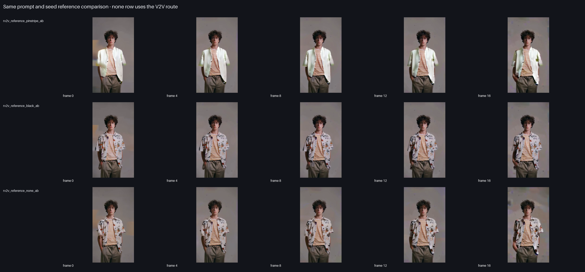
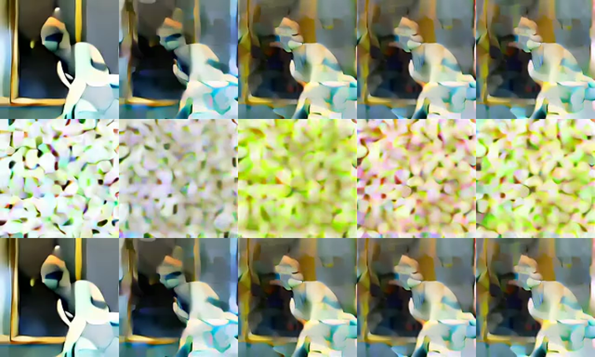

# Bernini-R 1.3B validation bundle

This is the durable five-phase engineering proof for MLX-Gen's renderer-only Bernini-R 1.3B integration. The
authoritative [portable bundle](bundle/) contains the generated MP4s, copied source/reference
inputs, official comparison clips, sidecars, commands, stdout/stderr logs, per-case contact sheets,
whole-process memory samples, numerical parity tensors/reports, quantization diagnostics, exact
hashes, and a hash-bound recorded visual inspection.

This bundle is the initial Monday, August 4, 2026 release-quality proof. It remains historically
accurate, but it is not the latest official-public-example status. Later local review accepted the
current official `i2i`, `t2i`, `t2v`, `r2v`, and `rv2v_case1` 1.3B example reruns; use the
[official example parity matrix](official_example_parity_matrix.md) for the current row-by-row
status.

The stricter "all public 1.3B examples" target is tracked separately in the
[official example parity matrix](official_example_parity_matrix.md). The current bundle does not yet
cover every public upstream example row.

The model-backed report separates execution from quality:

- machine contract: **PASS** for all ten cases;
- recorded visual inspection: **complete and hash-bound**;
- required visual quality: **FAIL** for all five required cases;
- overall report: **FAIL**.

See the [schema-v3 report](bundle/bernini_proof_report.json), [visual inspection](bundle/visual_review.md),
and [structured hash bindings](bundle/visual_review.json).

## Visual summary




The summary is 5952x8816, the role-control sheet is 5952x2768, and the timeline pages are 5312
pixels wide with 1024-pixel review cells. The overview is not the review surface by itself. The
sheet manifest covers 48 per-case sheets: all 146 MLX output frames, 102 exact conditioned-source
frames across six source timelines, and all 243 frames of the three long upstream clips across 15
ordered pages. Each case also has a 5K sheet of its largest localized-change transitions. The
848px/1280px rows are one-step memory/shape smokes and intentionally blurred. They are not quality
examples.

## Model-backed runs

Every row is an actual BF16 `--low-ram` CLI process. Each MP4 decodes at the exact recorded width,
height, frame count, and fps; component revisions, input order, sheets, logs, prompt truncation,
and whole-process physical footprint are machine-checked. A healthy file is not a quality pass.

| Case | Route | Size | Steps | Wall | Physical peak | Result and proof |
| --- | --- | --- | ---: | ---: | ---: | --- |
| Eight ordered references | R2V | 320x192x17 | 20 | 248.9 s | 9.12 GB | **FAIL.** [MP4](bundle/cases/run_1/r2v_eight_reference/r2v_eight_reference_17f.mp4), [sheet](bundle/cases/run_1/r2v_eight_reference/mlx_contact_sheet.png), [all 8 refs](bundle/cases/run_1/r2v_eight_reference/reference_contact_sheet.png). Nearly static, misses headphones/cup/action, and jumps at latent-slice boundaries. |
| Official-prompt garment edit | RV2V | 176x320x17 | 20 | 451.6 s | 9.22 GB | **FAIL.** [MP4](bundle/cases/run_1/rv2v_garment/rv2v_garment_17f.mp4), [sheet](bundle/cases/run_1/rv2v_garment/mlx_contact_sheet.png). Partial pinstripe transfer, but frames 13-16 have block, doubling, and subject corruption. |
| Older no-reference control | V2V | 176x320x17 | 20 | 335.4 s | 9.45 GB | **Negative control.** [MP4](bundle/cases/run_1/rv2v_no_reference_control/rv2v_no_reference_control_17f.mp4). Text-confounded, nearly static, and tail-degraded. |
| No-source control | R2V | 176x320x17 | 20 | 209.4 s | 8.99 GB | **Negative control.** [MP4](bundle/cases/run_1/rv2v_no_source_control/rv2v_no_source_control_17f.mp4). Route executes and composition changes, but quality is artificial and nearly static. |
| Neutral pinstripe-reference A/B | RV2V | 176x320x17 | 20 | 279.1 s | 9.09 GB | **FAIL.** [MP4](bundle/cases/run_1/rv2v_reference_pinstripe_ab/rv2v_reference_pinstripe_ab_17f.mp4). Reference sensitivity is visible, but motion, sleeves, and tail integrity fail. |
| Neutral black-shirt-reference A/B | RV2V | 176x320x17 | 20 | 122.0 s | 4.71 GB | **FAIL.** [MP4](bundle/cases/run_1/rv2v_reference_black_ab/rv2v_reference_black_ab_17f.mp4). The floral shirt remains and the black shirt/logo does not transfer. |
| Neutral no-reference context | V2V | 176x320x17 | 20 | 221.6 s | 9.03 GB | **Negative control.** [MP4](bundle/cases/run_1/rv2v_reference_none_ab/rv2v_reference_none_ab_17f.mp4). Crosses to the V2V APG branch and is not a strict reference-presence ablation. |
| Snowman insertion | V2V | 320x176x17 | 20 | 212.6 s | 9.22 GB | **FAIL.** [MP4](bundle/cases/run_1/v2v_snowman/v2v_snowman_17f.mp4), [sheet](bundle/cases/run_1/v2v_snowman/mlx_contact_sheet.png). Cartoon-like snowman, nearly static motion, and severe cyan/block corruption in frames 13-16. |
| 848px condition smoke | R2V | 128x128x5 | 1 | 14.6 s | 5.78 GB | [MP4](bundle/cases/run_1/r2v_848_condition_smoke/r2v_848_condition_smoke_5f.mp4). Structural and sampled-memory evidence only. |
| 1280px condition smoke | R2V | 128x128x5 | 1 | 20.9 s | 9.34 GB | [MP4](bundle/cases/run_1/r2v_1280_condition_smoke/r2v_1280_condition_smoke_5f.mp4). Hard condition-cap structural and sampled-memory evidence only. |

The pinstripe and black-shirt clips use the exact same RV2V branch, neutral prompt, source, seed,
dimensions, fps, and steps; only the reference changes. Their all-frame SSIM `0.841950` proves
sensitivity, not faithful control. Both rows fail. Cross-branch no-reference comparisons remain
illustrative only because they use V2V APG.

## Memory and disk conclusion

The largest bounded run measured **9.45 GB whole-process Darwin physical footprint** on a 128 GB
Apple Silicon host. A separate 33-frame, eight-reference 848-condition structural probe measured
**8.17 GB**. These shapes fit an 18 GB-class envelope, but this is not a direct 18 GB-host
measurement and says nothing about output acceptability. The official 848x480x81-frame/40-step
profile is unmeasured and is not claimed to fit.

A cold selective download is about **16.36 GiB**, and MLX-Gen retains **2 GiB** safety headroom;
the preflight therefore needs **18.36 GiB free**. A strict fresh 18 GB disk budget is slightly
short. If the pinned Wan base is already complete in cache, only the missing renderer files count,
which fits comfortably.

## Numerical parity

| Stage | Result | Evidence |
| --- | --- | --- |
| Diffusers 0.35.2 UniPC | Timesteps/sigmas exact; four-step replay max abs `1.335e-5` | [report](bundle/parity/scheduler_diffusers_0_35_2_report.json) |
| APG | Edge cases and realistic reductions pass; worst compact max abs `5.96e-7` | [report](bundle/parity/apg/parity_report.json) |
| Transformer FP32 | cosine `0.999999869`; relative L2 `0.0005369` | [report](bundle/parity/transformer/parity_report.json) |
| Transformer runtime BF16, five latent slices | cosine `0.99976615`; relative L2 `0.021655` | [report](bundle/parity/transformer_5slice/parity_runtime_report.json) |
| VAE, 17-frame encode/decode | shared-latent cosine `0.99999761`; relative L2 `0.00255` | [report](bundle/parity/vae_17f/vae_parity_report.json) |

The bundle retains the exact exported inputs and Torch/MLX tensors behind these summaries.
Cross-backend pixel identity and full-trajectory parity are not claimed; the numerical tests replay
identical inputs because PyTorch and MLX RNG streams differ. The remaining blocking parity fixture
must use real prompt/reference inputs and compare the first step through post-UniPC output.

## Controlled failure diagnostics

- [Exact upstream-prompt 33-frame MP4](bundle/diagnostics/exact_prompt_33/r2v_eight_reference_exact_prompt_33f_20steps.mp4),
  [recorded review](bundle/diagnostics/exact_prompt_33/visual_review.md),
  [frames 0-19](bundle/diagnostics/exact_prompt_33/mlx_contact_sheet_page_01.png),
  [frames 20-32](bundle/diagnostics/exact_prompt_33/mlx_contact_sheet_page_02.png), and
  [largest localized transitions](bundle/diagnostics/exact_prompt_33/mlx_worst_transitions_contact_sheet.png).
  This run uses all eight references and the exact 2,461-character prompt. Metadata records 571
  tokens and truncation to the 512-token budget. The output progressively collapses from about
  frame 13 and reaches severe geometry/mosaic corruption; its latent-boundary jump ratio is
  `2.0645`.
- [33-frame garment diagnostic](bundle/diagnostics/sequence_length_33_garment/rv2v_garment_33f_20steps.mp4)
  avoids the old terminal collapse but remains only a partial edit and retains periodic seams.
- [40-step snowman diagnostic](bundle/diagnostics/step_count_40/v2v_snowman_17f_40steps.mp4)
  reproduces the tail corruption, so doubling steps is not a fix.

The bundled upstream clips are labeled as qualitative targets. Their producing checkpoint and
inference recipe are not attested, so they are not Bernini-R 1.3B parity baselines.

## Quantization diagnosis



The three rows use the same prompt/reference/seed/canvas/frames/steps. BF16 is coherent; q4 is
catastrophically divergent; nominal q8 is byte-identical to BF16 because zero Bernini transformer
linear layers were quantized. The public renderer consequently rejects every `--quantize` value.
See the [structured diagnosis](bundle/diagnostics/quantization_diagnosis.json) and retained
[diagnostic files](bundle/diagnostics/).

## Provenance and integrity

- Official Bernini source revision: `2d2b4591ac053ec25c6371b01a5a6746679e5793`.
- Renderer revision: `ff4c5d4d2d31365c2ffeb30e9753065ee18f58ce`.
- Wan base revision: `ec4d2cb062b548996b179d493fdd05340de702a1`.
- [Component compatibility manifest](bundle/component_compatibility.json).
- [Portable SHA-256 manifest](bundle/portable_manifest.json), covering every bundled file except
  the manifest itself.
- [Upstream attribution](bundle/UPSTREAM_ATTRIBUTION.md) and retained
  [Apache-2.0 license](bundle/UPSTREAM_BERNINI_LICENSE.txt). The pinned upstream checkout had no
  `NOTICE` file.

Absolute workstation paths in text evidence are replaced by `<bundle-root>`, `<repo-root>`, and
`<official-source-root>`. Media and tensor bytes are unchanged. The raw ignored validation tree is
retained locally and can regenerate this clean bundle.

## Reproduce

```sh
uv run python tools/bernini_proof_bundle.py \
  --reference-root /path/to/official/Bernini \
  --output-dir validation_outputs/bernini_r_1_3b_2026_08_03/cycle4_proof \
  --durable-dir docs/assets/validation/bernini-r-1.3b-2026-08-04/bundle
```

Existing cases are reused only when the output exists and the versioned case fingerprint matches
the exact prompt, dimensions, frames, fps, steps, seed, reference order, source paths, condition
cap, model, and pinned component provenance. A changed case is regenerated instead of silently
certifying stale media. The exporter replaces its generated `bundle/` target, copies all
supplemental parity/quantization evidence, sanitizes paths, refreshes artifact hashes, and writes a
fresh portable manifest.

## Five completed engineering phases

1. Architecture and ADR review established role-aware references and explicit factored sources.
2. Numeric-core review proved scheduler, source-ID RoPE, packed transformer, APG, and VAE math.
3. Framework review covered CLI/Python routing, fail-closed validation, metadata, and low-RAM
   lifecycle while preserving ordinary Wan/VACE behavior.
4. Model-backed review generated eight clips plus two structural smokes, then full-frame inspection
   rejected the initial visual pass because motion, fidelity, cadence, and tail integrity failed.
5. Final review raised every proof sheet to 5K, paged long timelines, hash-bound every disposition,
   added controlled 33/40-step diagnostics, and kept the registry fail-closed after two adversarial
   audits.
