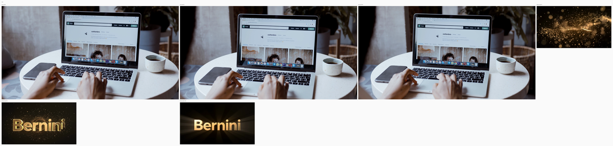
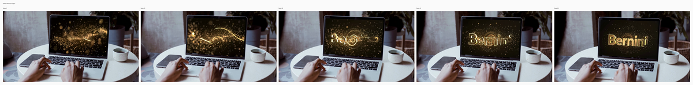
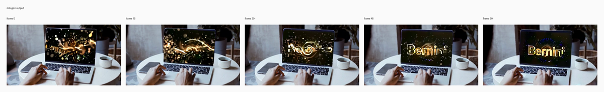

# ADS2V insert video on computer

## Input

- source video: `/private/tmp/bernini_official_20260810/assets/testcases/rv2v/source_case2.mp4`
- reference video 1: `/private/tmp/bernini_official_20260810/assets/testcases/rv2v/source_ref_case2.mp4`



Full resolution: [input_sheet.png](input_sheet.png)

## Request

- task: `ads2v`
- prompt: Add the video on the computer.

## Expected result

- The inserted video appears on the computer screen.
- The source scene stays intact outside the insertion region.
- The inserted content follows the screen area instead of taking over the whole scene.

## Actual result

- not yet manually reviewed
- inspect the mlx-gen output and compare it against the expected result above

## Run parameters

- seed: `42`
- steps: `40`
- guidance mode: `rv2v`
- output: `480x256`
- frames: `61`
- fps: `24`
- requested output target: `1280x672`, `61` frames, `24` fps

## Reproduce

```bash
uv run python validation_outputs/bernini_r_1_3b_2026_08_10/official_parity/run_official_public_cases.py --official-root /private/tmp/bernini_official_20260810 --out-dir validation_outputs/bernini_r_1_3b_2026_08_11/head_ads2v_mid480_61f --case ads2v --seed 42 --steps 40 --max-condition-size 480 --override-fps 24 --override-frames 61 --low-ram
```

## Official reference output



Full resolution: [official_sheet.png](official_sheet.png)

## mlx-gen output



Full resolution: [mlx_sheet.png](mlx_sheet.png)

## Artifacts

- output: `ads2v.mp4`
- metadata: `ads2v.metadata.json`
- input sheet: [input_sheet.png](input_sheet.png)
- official sheet: [official_sheet.png](official_sheet.png)
- mlx sheet: [mlx_sheet.png](mlx_sheet.png)
- initial noise: `initial_noise.npy` in the source validation run (not bundled)
- official output: `/private/tmp/bernini_official_20260810/assets/testcases/rv2v/rv2v_case2_out.mp4`
- source validation run: `/Users/albou/projects/gh/mlx-gen/validation_outputs/bernini_r_1_3b_2026_08_11/head_ads2v_mid480_61f/ads2v` (local harness only)
