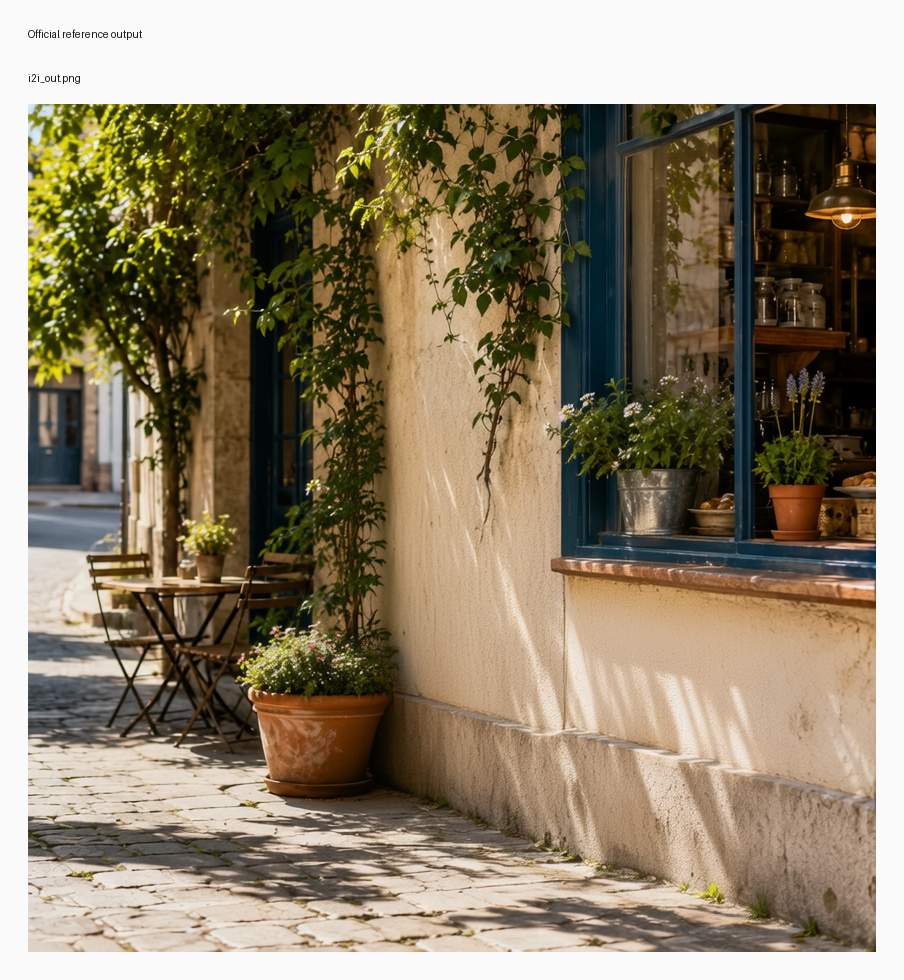

# I2I bicycle removal

## Input

- source image: `/private/tmp/bernini_official_20260810/assets/testcases/i2i/source.png`


Full resolution: [input_sheet.png](input_sheet.png)

## Request

- task: `i2i`
- prompt: Delete the bicycle parked in front of the window. Fill in the area behind it with the continuation of the window frame, wall, and ground that surround it, matching the existing perspective, lighting direction, and shadow softness so the removal is seamless. The window itself, the wall, the ground, and all other objects in the scene remain completely unchanged.

## Expected result

- The bicycle is removed.
- Window frame, wall, and ground continue cleanly through the removed region.
- Everything else in the scene stays unchanged.

## Actual result

- The bicycle is removed cleanly from the foreground.
- The window frame, wall, and ground continue plausibly through the removed area.
- Manual review on Tuesday, August 11, 2026 accepted this row as working, with a minor caveat that the wall texture reads slightly more patterned than the official image.

## Run parameters

- seed: `42`
- steps: `40`
- guidance mode: `v2v`
- output: `848x848`
- frames: `1`
- fps: `16`

## Reproduce

```bash
uv run python validation_outputs/bernini_r_1_3b_2026_08_10/official_parity/run_official_public_cases.py --official-root /private/tmp/bernini_official_20260810 --out-dir validation_outputs/bernini_r_1_3b_2026_08_10/official_parity/exact_noise_i2i --case i2i --seed 42 --steps 40
```

## Official reference output



Full resolution: [official_sheet.png](official_sheet.png)

## mlx-gen output


Full resolution: [mlx_sheet.png](mlx_sheet.png)

## Artifacts

- output: `i2i.png`
- metadata: `i2i.metadata.json`
- input sheet: [input_sheet.png](input_sheet.png)
- official sheet: [official_sheet.png](official_sheet.png)
- mlx sheet: [mlx_sheet.png](mlx_sheet.png)
- initial noise: `initial_noise.npy` in the source validation run (not bundled)
- official output: `/private/tmp/bernini_official_20260810/assets/testcases/i2i/i2i_out.png`
- source validation run: `/Users/albou/projects/gh/mlx-gen/validation_outputs/bernini_r_1_3b_2026_08_10/official_parity/exact_noise_i2i/i2i` (local harness only)
