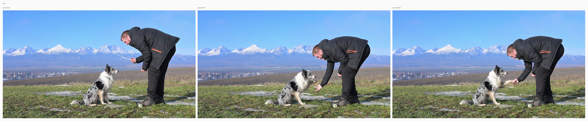
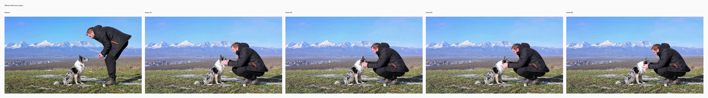
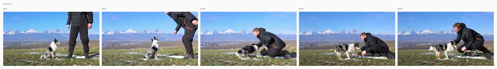

# MV2V crouching beside dog

## Input

- source video: `/private/tmp/bernini_official_20260810/assets/testcases/v2v/source_case2.mp4`



## Request

- task: `mv2v`
- prompt: Change the person's motion so that the person crouches down naturally beside the dog, with bent knees and a lowered body posture instead of remaining bent over from standing, while preserving the same person, black winter jacket, black pants, boots, position on the right side of the frame, interaction with the seated dog, camera framing, outdoor lighting, background, ground texture, shadows, and all other scene elements unchanged. A clear daytime mountain landscape remains in the background with a bright blue sky, snow-covered peaks, distant fields and houses, and a grassy patch with scattered snow in the foreground; the black, white, and gray dog stays seated near the center-left facing the person, while the person on the right is now squatting close to the dog at a similar distance, leaning slightly forward to interact, with realistic body proportions, natural balance, and consistent contact with the ground, and the overall video motion stays smooth and realistic.

## Expected result

- The same person and dog stay in the same scene.
- The person crouches down instead of staying bent over standing.
- Background, lighting, and framing stay consistent.

## Actual result

- not yet manually reviewed
- inspect the mlx-gen output and compare it against the expected result above

## Run parameters

- seed: `42`
- steps: `40`
- guidance mode: `v2v_apg`
- output: `848x480`
- frames: `81`
- fps: `16`

## Reproduce

```bash
uv run python validation_outputs/bernini_r_1_3b_2026_08_10/official_parity/run_official_public_cases.py --official-root /private/tmp/bernini_official_20260810 --out-dir validation_outputs/bernini_r_1_3b_2026_08_11/head_canvasfix_mv2v_full_v2 --case mv2v --seed 42 --steps 40 --max-condition-size 848 --low-ram
```

## Official reference output



## mlx-gen output



## Artifacts

- output: `validation_outputs/bernini_r_1_3b_2026_08_11/head_canvasfix_mv2v_full_v2/mv2v/mv2v.mp4`
- metadata: `validation_outputs/bernini_r_1_3b_2026_08_11/head_canvasfix_mv2v_full_v2/mv2v/mv2v.metadata.json`
- initial noise: `validation_outputs/bernini_r_1_3b_2026_08_11/head_canvasfix_mv2v_full_v2/mv2v/initial_noise.npy` (torch-cpu-manual-seed, seed=42)
- runtime policy: `low_ram=True`, `clear_cache_each_step=True`, `clear_cache_each_transformer_block=False`, `release_denoisers_before_decode=True`
- case json: `/private/tmp/bernini_official_20260810/assets/testcases/v2v/v2v_case2.json`
- official output: `/private/tmp/bernini_official_20260810/assets/testcases/v2v/v2v_case2_out.mp4`
