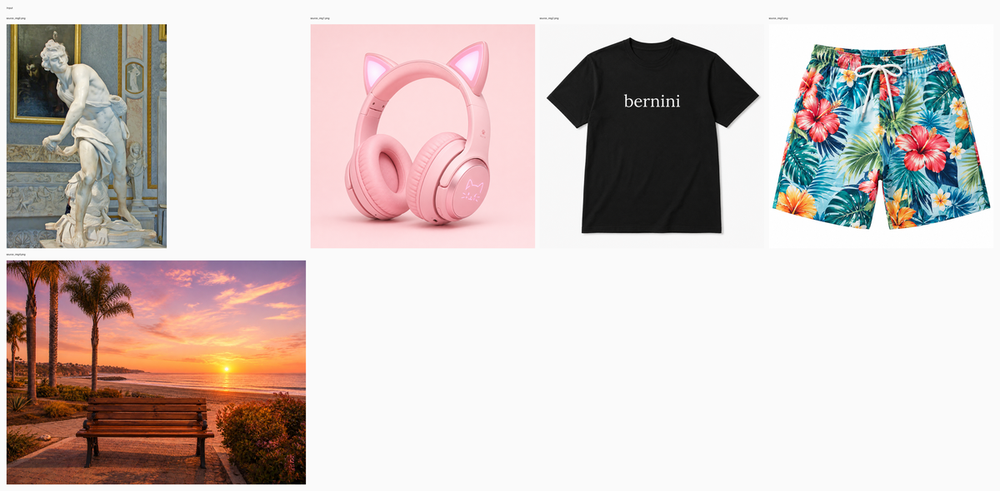
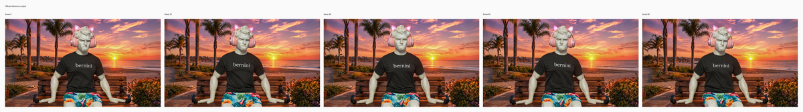
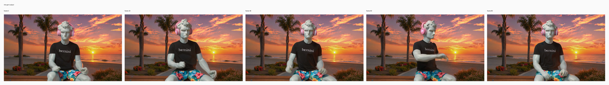

# R2V statue on bench

## Input

- reference image 1: `/private/tmp/bernini_official_20260810/assets/testcases/r2v/source_img0.png`
- reference image 2: `/private/tmp/bernini_official_20260810/assets/testcases/r2v/source_img1.png`
- reference image 3: `/private/tmp/bernini_official_20260810/assets/testcases/r2v/source_img2.png`
- reference image 4: `/private/tmp/bernini_official_20260810/assets/testcases/r2v/source_img3.png`
- reference image 5: `/private/tmp/bernini_official_20260810/assets/testcases/r2v/source_img4.png`



Full resolution: [input_sheet.png](input_sheet.png)

## Request

- task: `r2v`
- prompt: The marble statue from image0, wearing the black T-shirt from image2, the tropical floral shorts from image3, and the pink cat-ear headphones from image1, sits on the wooden bench in the beach sunset setting from image4, facing the camera and gently bobbing and swaying to the music in a medium shot. Generate a video where the marble statue from image0 is the main subject, with the same muscular stone body, curly sculpted hair, and classical carved appearance, now humorously dressed in the black short-sleeve T-shirt from image2 with the white word "bernini" across the chest, the bright blue tropical floral shorts from image3 with large red, orange, and yellow flowers and green leaves, and the pink over-ear cat-ear headphones from image1 with soft padded earcups and glowing cat-face details on the sides. He is seated on the wooden bench from image4, centered in the frame and facing directly toward the camera in a medium shot. Keep the environment unchanged from image4: a seaside promenade with the wooden bench in the foreground, sandy beach and calm ocean behind it, palm trees rising on the left, low shrubs and flowers along the walkway, and a vivid sunset sky glowing with warm orange, pink, and purple tones as the sun sits low near the horizon. At the start, the statue is already seated upright on the bench, facing the camera, with his body proportions and physique unchanged from image0 and the beach scene composition preserved from image4. Then he begins moving subtly and rhythmically as if listening to music through the headphones, gently nodding his head, swaying his upper body slightly, and rocking side to side in a natural music-driven motion. After that, he continues the relaxed groove with small head tilts, light shoulder movement, and a steady seated bounce, always remaining seated on the bench and facing the camera. The motion should feel smooth, playful, and realistic, without exaggerated deformation, while keeping the bench, sunset beach background, and overall scene from image4 unchanged.

## Expected result

- The marble statue becomes the main subject on the bench scene.
- Headphones, shirt, shorts, and beach bench setting are all present.
- The statue shows gentle music-like motion while staying seated.

## Actual result

- The statue, bench scene, headphones, shirt, and shorts are all present and recognizable.
- The subject stays seated facing the camera with gentle music-like motion.
- Manual review on Tuesday, August 11, 2026 accepted this row as working.

## Run parameters

- seed: `42`
- steps: `40`
- guidance mode: `r2v_apg`
- output: `848x480`
- frames: `81`
- fps: `16`

## Reproduce

```bash
uv run python validation_outputs/bernini_r_1_3b_2026_08_10/official_parity/run_official_public_case_segmented.py --official-root /private/tmp/bernini_official_20260810 --out-dir validation_outputs/bernini_r_1_3b_2026_08_10/official_parity_segmented_r2v_40step_launchd_round7 --case r2v --seed 42 --steps 40 --segment-steps 4 --low-ram --no-checkpoint-preview
```

## Official reference output



Full resolution: [official_sheet.png](official_sheet.png)

## mlx-gen output



Full resolution: [mlx_sheet.png](mlx_sheet.png)

## Artifacts

- output: `r2v.mp4`
- metadata: `r2v.metadata.json`
- input sheet: [input_sheet.png](input_sheet.png)
- official sheet: [official_sheet.png](official_sheet.png)
- mlx sheet: [mlx_sheet.png](mlx_sheet.png)
- initial noise: `initial_noise.npy` in the source validation run (not bundled)
- official output: `/private/tmp/bernini_official_20260810/assets/testcases/r2v/r2v_out.mp4`
- source validation run: `/Users/albou/projects/gh/mlx-gen/validation_outputs/bernini_r_1_3b_2026_08_10/official_parity_segmented_r2v_40step_launchd_round7/r2v` (local harness only)
