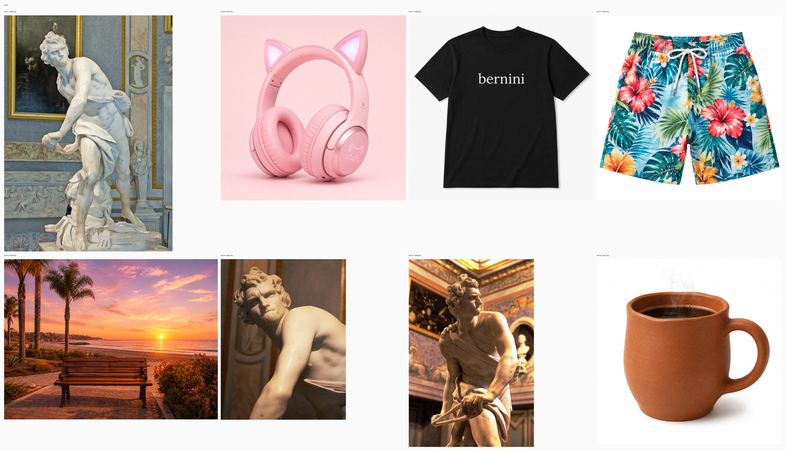
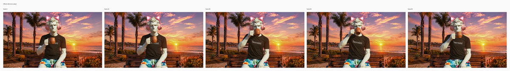
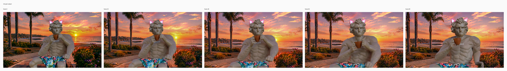

# R2V statue with cup

## Input

- reference image 1: `/private/tmp/bernini_official_20260810/assets/testcases/r2v/source_img0.png`
- reference image 2: `/private/tmp/bernini_official_20260810/assets/testcases/r2v/source_img1.png`
- reference image 3: `/private/tmp/bernini_official_20260810/assets/testcases/r2v/source_img2.png`
- reference image 4: `/private/tmp/bernini_official_20260810/assets/testcases/r2v/source_img3.png`
- reference image 5: `/private/tmp/bernini_official_20260810/assets/testcases/r2v/source_img4.png`
- reference image 6: `/private/tmp/bernini_official_20260810/assets/testcases/r2v/source_img5.png`
- reference image 7: `/private/tmp/bernini_official_20260810/assets/testcases/r2v/source_img6.png`
- reference image 8: `/private/tmp/bernini_official_20260810/assets/testcases/r2v/source_img7.png`



Full resolution: [input_sheet.png](input_sheet.png)

## Request

- task: `r2v`
- prompt: Place the male marble sculpture from image0, image5, and image6 on the bench in image4, wearing the pink cat-ear headphones from image1, the black T-shirt from image2, and the floral shorts from image3, holding the cup from image7 and slowly drinking from it with no steam visible, always facing the camera and gently moving to the music in a fixed medium shot. Generate a video where the male marble sculpture from image0, image5, and image6 appears as the main subject, maintaining the same white stone material, curly sculpted hair, muscular torso, and serious classical facial features seen in the reference images. He is dressed with the pink over-ear cat-ear headphones from image1, featuring soft pink ear cups and glowing-style cat ear shapes on top, along with the black short-sleeve T-shirt from image2 with the word "bernini" written across the chest in white, and the bright tropical floral shorts from image3 with large red, yellow, and white flowers, blue-green leaves, and a white drawstring. He is seated on the wooden bench from image4 in a seaside setting at sunset, with the bench centered on a paved path, palm trees rising on the left, low coastal plants and bushes around the foreground, and the beach, ocean, and glowing sun stretching across the background under a pink, orange, and purple sky. The lighting is warm and golden, consistent with sunset, casting a soft, relaxing atmosphere over the whole scene. The sculpture should always remain visible in the frame, seated on the bench and facing directly toward the camera. He holds the cup from image7 the entire time, matching its rounded brown ceramic appearance and handle, but do not show any steam coming from it. At the start of the video, he sits upright on the bench in a calm pose, already holding the cup near his torso, with a subtle rhythmic sway in his shoulders and upper body as if responding to music. Then he slowly lifts the cup toward his mouth in a natural, controlled motion, keeping his body mostly facing front. After that, he gently tilts the cup and takes a sip, with slow, realistic movement suitable for a statue brought to life. Then he lowers the cup slightly while continuing a soft, music-like bobbing motion of the head and torso. Throughout the video, the camera remains fixed in a medium shot, the motions stay slow and smooth, and all visual details of the sculpture, clothing, headphones, bench, and cup remain consistent with the reference images.

## Expected result

- The same marble statue is seated on the sunset bench scene.
- Headphones, shirt, shorts, and cup all stay present and recognizable.
- The statue gently drinks from the cup while facing the camera.

## Actual result

- not yet manually reviewed
- inspect the mlx-gen output and compare it against the expected result above

## Run parameters

- seed: `43`
- steps: `40`
- guidance mode: `r2v_apg`
- output: `848x480`
- frames: `81`
- fps: `16`

## Reproduce

```bash
uv run python validation_outputs/bernini_r_1_3b_2026_08_10/official_parity/run_official_public_cases.py --official-root /private/tmp/bernini_official_20260810 --out-dir validation_outputs/bernini_r_1_3b_2026_08_11/exp_r2v_case2_full_refg6_s43 --case r2v_case2 --seed 43 --steps 40 --reference-guidance 6.0 --max-condition-size 848 --low-ram
```

## Official reference output



Full resolution: [official_sheet.png](official_sheet.png)

## mlx-gen output



Full resolution: [mlx_sheet.png](mlx_sheet.png)

## Artifacts

- output: `r2v_case2.mp4`
- metadata: `r2v_case2.metadata.json`
- input sheet: [input_sheet.png](input_sheet.png)
- official sheet: [official_sheet.png](official_sheet.png)
- mlx sheet: [mlx_sheet.png](mlx_sheet.png)
- initial noise: `initial_noise.npy` in the source validation run (not bundled)
- official output: `/private/tmp/bernini_official_20260810/assets/testcases/r2v/r2v_case2_out.mp4`
- source validation run: `/Users/albou/projects/gh/mlx-gen/validation_outputs/bernini_r_1_3b_2026_08_11/exp_r2v_case2_full_refg6_s43/r2v_case2` (local harness only)
