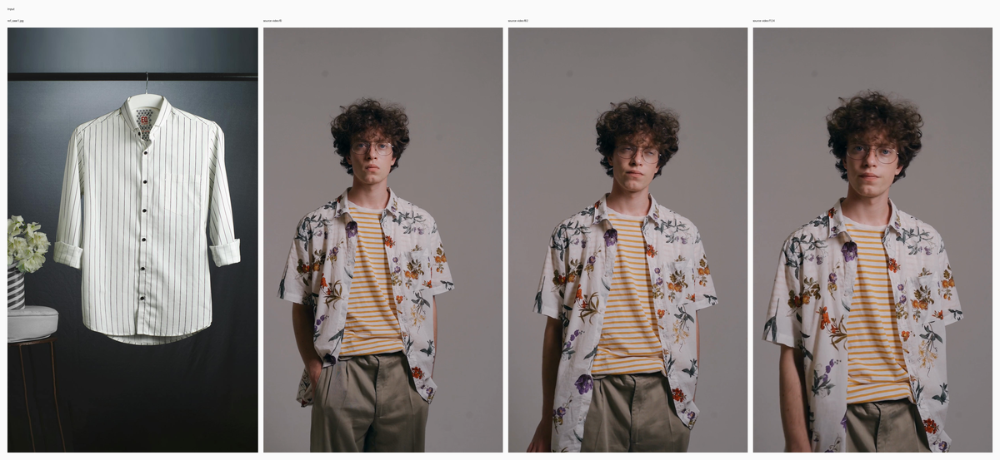
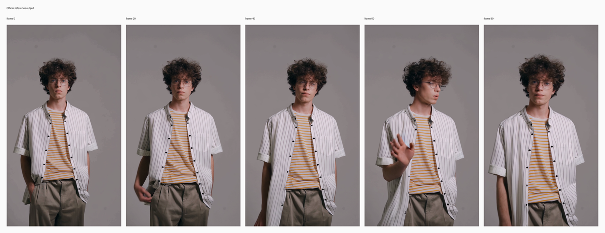
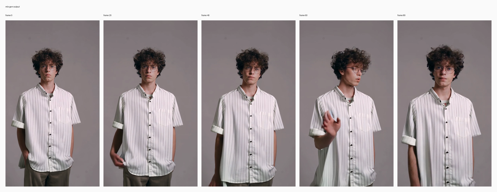

# RV2V garment replacement

## Input

- source video: `/private/tmp/bernini_official_20260810/assets/testcases/rv2v/source_case1.mp4`
- reference image 1: `/private/tmp/bernini_official_20260810/assets/testcases/rv2v/ref_case1.jpg`



Full resolution: [input_sheet.png](input_sheet.png)

## Request

- task: `rv2v`
- prompt: Replace the person's outer shirt with the shirt from the reference image while keeping the inner undershirt unchanged, preserving the original body pose, fit behavior, camera framing, lighting, background, pants, hair, skin, shadows, and overall motion exactly as they are. The person stands against the same plain light gray studio backdrop with the same subtle movement and relaxed posture, still wearing the original yellow and white horizontally striped inner T-shirt underneath, while the outer garment is now a clean white button-up shirt with thin vertical dark pinstripes, a short stand collar, black front buttons, and a left chest pocket, appearing naturally worn on the body with realistic fabric drape and motion instead of hanging flat, and all other scene elements remain unchanged.

## Expected result

- The outer shirt is replaced by the white pinstripe button-up shirt.
- The inner yellow-and-white undershirt stays unchanged.
- Pose, body, background, lighting, and motion stay consistent.

## Actual result

- The outer shirt is replaced by the white pinstripe button-up while the person, pose, and scene stay intact.
- The shirt stays slightly more closed than in the official output, so less undershirt remains visible, but the fit and temporal stability are correct.
- Manual review on Tuesday, August 11, 2026 accepted this row as working.

## Run parameters

- seed: `42`
- steps: `20`
- guidance mode: `rv2v`
- output: `480x848`
- frames: `81`
- fps: `16`

## Reproduce

```bash
uv run python validation_outputs/bernini_r_1_3b_2026_08_10/official_parity/run_official_public_cases.py --official-root /private/tmp/bernini_official_20260810 --out-dir validation_outputs/bernini_r_1_3b_2026_08_10/official_parity_rv2v_case1_steps20_current_launchd_v1 --case rv2v_case1 --seed 42 --steps 20 --low-ram
```

## Official reference output



Full resolution: [official_sheet.png](official_sheet.png)

## mlx-gen output



Full resolution: [mlx_sheet.png](mlx_sheet.png)

## Artifacts

- output: `rv2v_case1.mp4`
- metadata: `rv2v_case1.metadata.json`
- input sheet: [input_sheet.png](input_sheet.png)
- official sheet: [official_sheet.png](official_sheet.png)
- mlx sheet: [mlx_sheet.png](mlx_sheet.png)
- initial noise: `initial_noise.npy` in the source validation run (not bundled)
- official output: `/private/tmp/bernini_official_20260810/assets/testcases/rv2v/rv2v_case1_out.mp4`
- source validation run: `/Users/albou/projects/gh/mlx-gen/validation_outputs/bernini_r_1_3b_2026_08_10/official_parity_rv2v_case1_steps20_current_launchd_v1/rv2v_case1` (local harness only)
