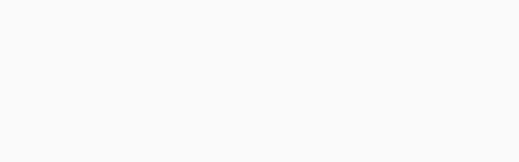
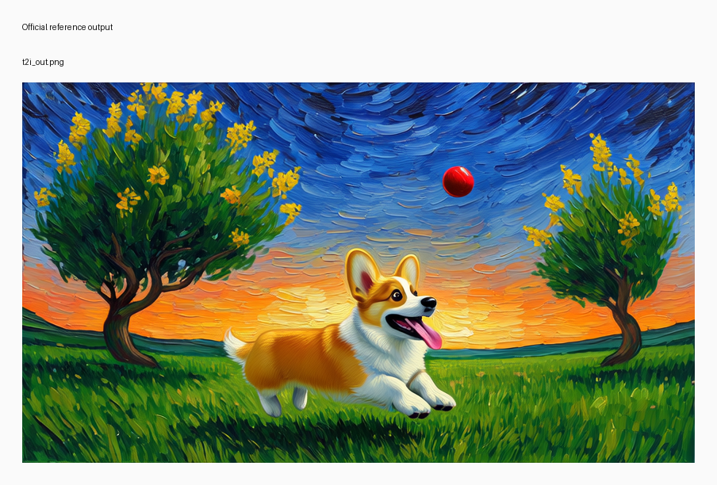
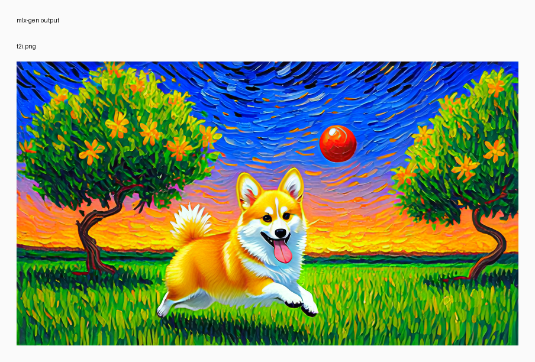

# T2I Van Gogh corgi

## Input

- no input media



Full resolution: [input_sheet.png](input_sheet.png)

## Request

- task: `t2i`
- prompt: Van Gogh style painting. A cute, happy Corgi with fluffy golden and white fur, short sturdy legs, and a wide open mouth with its pink tongue hanging out. The dog is captured mid-leap above a grassy park, frozen in the air as it reaches toward a small red ball suspended just ahead of it, its large ears swept backward. The background features thick, expressive, swirling oil brushstrokes. The sky above is a vibrant, clear deep blue filled with swirling patterns, transitioning into bright orange and yellow sunset hues near the horizon. Green trees with twisted trunks and tall yellow flowers lean to one side as if caught in the wind.

## Expected result

- A single image, not a video.
- A corgi mid-leap toward a red ball.
- Strong Van Gogh-style brushstroke texture and swirling sky.

## Actual result

- A single corgi image is generated with the red ball and strong Van Gogh-style brushstroke texture.
- The main subject, color palette, and swirling-sky style match the official task outcome.
- Manual review on Tuesday, August 11, 2026 accepted this row as working.

## Run parameters

- seed: `42`
- steps: `40`
- guidance mode: `t2v_apg`
- output: `848x480`
- frames: `1`
- fps: `16`

## Reproduce

```bash
uv run python validation_outputs/bernini_r_1_3b_2026_08_10/official_parity/run_official_public_cases.py --official-root /private/tmp/bernini_official_20260810 --out-dir validation_outputs/bernini_r_1_3b_2026_08_10/official_parity/exact_noise_t2i --case t2i --seed 42 --steps 40
```

## Official reference output



Full resolution: [official_sheet.png](official_sheet.png)

## mlx-gen output



Full resolution: [mlx_sheet.png](mlx_sheet.png)

## Artifacts

- output: `t2i.png`
- metadata: `t2i.metadata.json`
- input sheet: [input_sheet.png](input_sheet.png)
- official sheet: [official_sheet.png](official_sheet.png)
- mlx sheet: [mlx_sheet.png](mlx_sheet.png)
- initial noise: `initial_noise.npy` in the source validation run (not bundled)
- official output: `/private/tmp/bernini_official_20260810/assets/testcases/t2i/t2i_out.png`
- source validation run: `/Users/albou/projects/gh/mlx-gen/validation_outputs/bernini_r_1_3b_2026_08_10/official_parity/exact_noise_t2i/t2i` (local harness only)
