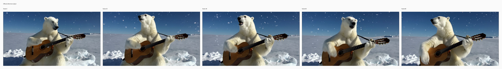
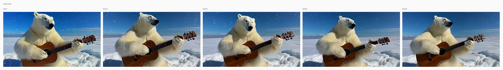

# T2V polar bear guitar

## Input

- no input media


## Request

- task: `t2v`
- prompt: Day time, side lighting, medium shot, center composition. A large, fluffy white polar bear sits upright on a snowbank, holding a brown wooden acoustic guitar. The bear's thick furry right paw continuously strums the metal strings up and down, while its heavy body sways side to side. The bear's dark black nose twitches, and its mouth is slightly open as it moves its head. Behind the polar bear, white snowflakes gently drift downward across a vast icy landscape under a bright, deep blue sky. Sunlight casts crisp shadows on the snowy ground, illuminating the bear's thick fur and the polished surface of the guitar.

## Expected result

- A polar bear remains the main subject.
- Guitar strumming and body sway are visible.
- Snowy daylight scene stays coherent.

## Actual result

- A polar bear remains the main subject in the snowy daylight scene.
- Guitar strumming and body sway are visible across the clip.
- Manual review on Tuesday, August 11, 2026 accepted this row as working.

## Run parameters

- seed: `42`
- steps: `40`
- guidance mode: `t2v_apg`
- output: `848x480`
- frames: `81`
- fps: `16`

## Reproduce

```bash
uv run python validation_outputs/bernini_r_1_3b_2026_08_10/official_parity/run_official_public_cases.py --official-root /private/tmp/bernini_official_20260810 --out-dir validation_outputs/bernini_r_1_3b_2026_08_10/official_parity/exact_noise_t2v --case t2v --seed 42 --steps 40
```

## Official reference output



## mlx-gen output



## Artifacts

- output: `validation_outputs/bernini_r_1_3b_2026_08_10/official_parity/exact_noise_t2v/t2v/t2v.mp4`
- metadata: `validation_outputs/bernini_r_1_3b_2026_08_10/official_parity/exact_noise_t2v/t2v/t2v.metadata.json`
- initial noise: `validation_outputs/bernini_r_1_3b_2026_08_10/official_parity/exact_noise_t2v/t2v/initial_noise.npy` (torch-cpu-manual-seed, seed=42)
- case json: `/private/tmp/bernini_official_20260810/assets/testcases/t2v/t2v.json`
- official output: `/private/tmp/bernini_official_20260810/assets/testcases/t2v/t2v_out.mp4`
