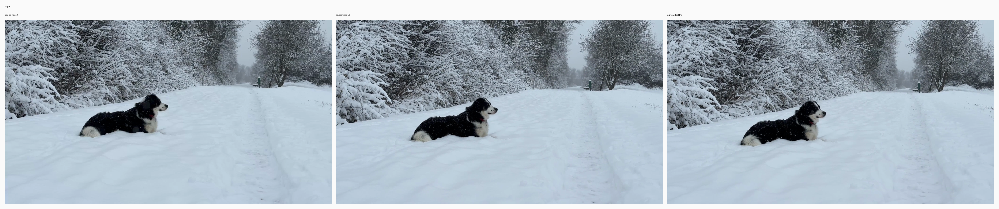
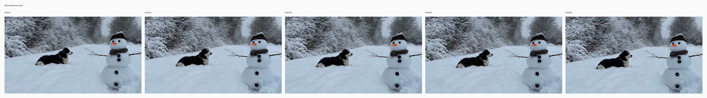
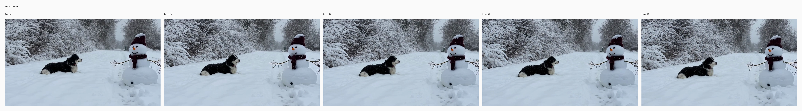

# V2V add snowman

## Input

- source video: `/private/tmp/bernini_official_20260810/assets/testcases/v2v/source_case1.mp4`



## Request

- task: `v2v`
- prompt: Add a realistic snowman on the right side of the snowy path, positioned in the mid-right ground so it sits naturally beside the trail without blocking the black-and-white dog. Make it a classic three-snowball snowman, about medium height relative to the dog, with a carrot nose, small coal eyes, a few coal buttons, thin twig arms, and a dark knit hat with a muted scarf. Match the overcast winter lighting and snowy atmosphere, with soft diffuse shadows, slight snow accumulation on the hat and shoulders, and its base partially embedded in the snow. Ensure stable placement and scale across the video, with accurate perspective, consistent contact with the ground, and no flicker or drifting. Keep the dog, the snow-covered road, the snowy trees and bushes, the distant green post, and the overall winter scene unchanged.

## Expected result

- A realistic snowman is added on the right side of the snowy path.
- The dog, path, winter lighting, and scene framing stay unchanged.
- The snowman stays stably placed without flicker or drifting.

## Actual result

- A realistic snowman appears on the right side of the snowy path.
- The dog and winter scene stay intact while the snowman remains stable in position and scale.
- Manual review on Tuesday, August 11, 2026 accepted this row as working.

## Run parameters

- seed: `42`
- steps: `40`
- guidance mode: `v2v_apg`
- output: `848x480`
- frames: `81`
- fps: `16`

## Reproduce

```bash
uv run python validation_outputs/bernini_r_1_3b_2026_08_10/official_parity/run_official_public_case_segmented.py --official-root /private/tmp/bernini_official_20260810 --out-dir validation_outputs/bernini_r_1_3b_2026_08_10/official_parity_segmented_v2v_case1_launchd_round3 --case v2v_case1 --seed 42 --steps 40 --segment-steps 5 --max-condition-size 848 --low-ram --no-checkpoint-preview
```

## Official reference output



## mlx-gen output



## Artifacts

- output: `validation_outputs/bernini_r_1_3b_2026_08_10/official_parity_segmented_v2v_case1_launchd_round3/v2v_case1/v2v_case1.mp4`
- metadata: `validation_outputs/bernini_r_1_3b_2026_08_10/official_parity_segmented_v2v_case1_launchd_round3/v2v_case1/v2v_case1.metadata.json`
- initial noise: `validation_outputs/bernini_r_1_3b_2026_08_10/official_parity_segmented_v2v_case1_launchd_round3/v2v_case1/initial_noise.npy` (torch-cpu-manual-seed, seed=42)
- runtime policy: `low_ram=True`, `clear_cache_each_step=True`, `clear_cache_each_transformer_block=False`, `release_denoisers_before_decode=True`
- case json: `/private/tmp/bernini_official_20260810/assets/testcases/v2v/v2v_case1.json`
- official output: `/private/tmp/bernini_official_20260810/assets/testcases/v2v/v2v_case1_out.mp4`
