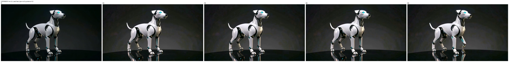

# V2V robot to robotic dog (mv2v-prefix recovery)

This row uses the official `mv2v` task prefix with text guidance `5.0` to recover the
quadruped robotic dog outcome that the official `v2v` recipe fails to produce at 1.3B.

## Request

- task: `mv2v`
- prompt: Replace the white humanoid robot standing on the dark reflective surface with a sleek robotic dog in the same position and scale, preserving the dark studio background, lighting, reflections, and camera framing. The new subject should be a futuristic four-legged mechanical dog with a white outer shell, black joint details, subtle glowing eyes, and articulated metal legs. Match the original motion by having the robotic dog perform a comparable animated pose sequence, with natural mechanical movement and consistent shadows and reflections on the floor.

## mlx-gen output

## Artifacts

- output: `v2v_case3_mv2vprefix.mp4`
- metadata: `v2v_case3_mv2vprefix.metadata.json`
