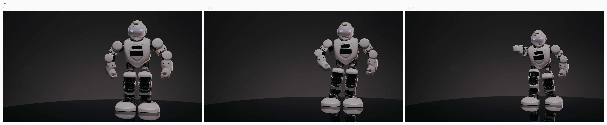
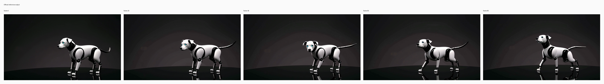
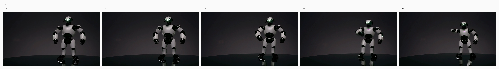

# V2V robot to robotic dog

## Input

- source video: `/private/tmp/bernini_official_20260810/assets/testcases/v2v/source_case3.mp4`



## Request

- task: `v2v`
- prompt: Replace the white humanoid robot standing on the dark reflective surface with a sleek robotic dog in the same position and scale, preserving the dark studio background, lighting, reflections, and camera framing. The new subject should be a futuristic four-legged mechanical dog with a white outer shell, black joint details, subtle glowing eyes, and articulated metal legs. Match the original motion by having the robotic dog perform a comparable animated pose sequence, with natural mechanical movement and consistent shadows and reflections on the floor.

## Expected result

- The humanoid robot is replaced by a robotic dog.
- The dog stays in the same position and scale.
- Studio lighting, reflections, and camera framing stay consistent.

## Actual result

- not yet manually reviewed
- inspect the mlx-gen output and compare it against the expected result above

## Run parameters

- seed: `42`
- steps: `40`
- guidance mode: `v2v_apg`
- output: `848x480`
- frames: `81`
- fps: `16`

## Reproduce

```bash
uv run python validation_outputs/bernini_r_1_3b_2026_08_10/official_parity/run_official_public_cases.py --official-root /private/tmp/bernini_official_20260810 --out-dir validation_outputs/bernini_r_1_3b_2026_08_11/head_v2v_case3_full_v2 --case v2v_case3 --seed 42 --steps 40 --max-condition-size 848 --low-ram
```

## Official reference output



## mlx-gen output



## Artifacts

- output: `validation_outputs/bernini_r_1_3b_2026_08_11/head_v2v_case3_full_v2/v2v_case3/v2v_case3.mp4`
- metadata: `validation_outputs/bernini_r_1_3b_2026_08_11/head_v2v_case3_full_v2/v2v_case3/v2v_case3.metadata.json`
- initial noise: `validation_outputs/bernini_r_1_3b_2026_08_11/head_v2v_case3_full_v2/v2v_case3/initial_noise.npy` (torch-cpu-manual-seed, seed=42)
- runtime policy: `low_ram=True`, `clear_cache_each_step=True`, `clear_cache_each_transformer_block=False`, `release_denoisers_before_decode=True`
- case json: `/private/tmp/bernini_official_20260810/assets/testcases/v2v/v2v_case3.json`
- official output: `/private/tmp/bernini_official_20260810/assets/testcases/v2v/v2v_case3_out.mp4`
