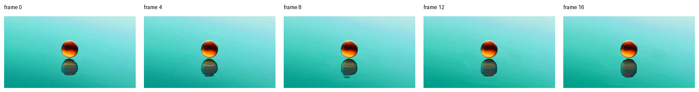
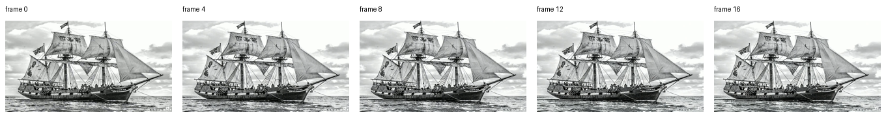

# Getting Started

This guide covers the shortest path from a fresh MLX-Gen install to a local image or video generation run.

## Install

Install MLX-Gen as a `uv` tool:

```sh
uv tool install --upgrade mlx-gen
```

Check the command surface:

```sh
mlxgen --help
```

The top-level command shows the three public workflows:

- `mlxgen generate` for image generation, image editing, and supported video generation.
- `mlxgen download` for explicit Hugging Face cache downloads.
- `mlxgen prepare` for reusable local MLX-Gen model folders.

## Prepare Model Files

Generation is cache-only. Before generation, either download the source repository into the local Hugging Face cache or prepare a reusable local folder.

Download into the Hugging Face cache:

```sh
mlxgen download --model z-image-turbo
```

Prepare a reusable local folder with quantized weights and a generated Hugging Face model card:

```sh
mlxgen prepare \
  --model Qwen/Qwen-Image \
  --path ./models/qwen-image-8bit \
  --quantize 8
```

Use `mlxgen prepare` when you need a local model folder. There is no separate MLX-Gen `save` workflow in the public documentation.

`HF_HUB_ENABLE_HF_TRANSFER=1` is optional. It can speed up explicit Hugging Face download or prepare commands when the accelerated transfer backend is available, but it is not required to authorize downloads.

Bonsai Image checkpoints are already packed MLX artifacts. Use `mlxgen download` for Bonsai, not
`mlxgen prepare`.

## Generate An Image

Run generation from a cached alias or repository:

```sh
mlxgen generate \
  --model z-image-turbo \
  --prompt "A puffin standing on a cliff" \
  --width 1280 \
  --height 500 \
  --seed 42 \
  --steps 9 \
  --quantize 8
```

Run generation from a prepared local folder:

```sh
mlxgen generate \
  --model ./models/qwen-image-8bit \
  --family qwen \
  --prompt "A clean studio product photo" \
  --output image.png
```

`--family` is useful when a local path or custom repository name does not contain a recognizable model-family name.

Run Bonsai Image from its pre-packed ternary checkpoint:

```sh
mlxgen download --model prism-ml/bonsai-image-ternary-4B-mlx-2bit

mlxgen generate \
  --model prism-ml/bonsai-image-ternary-4B-mlx-2bit \
  --prompt "A bonsai tree in a quiet ceramic studio, soft morning light" \
  --width 1024 \
  --height 1024 \
  --steps 4 \
  --guidance 1 \
  --seed 42 \
  --output bonsai.png
```

## Edit An Image

Pass one or more input images to the same `generate` command. MLX-Gen routes to the edit backend from the model and image inputs:

```sh
mlxgen generate \
  --model AbstractFramework/qwen-image-edit-2511-4bit \
  --image input.png \
  --prompt "Turn the room into a pencil sketch" \
  --steps 20 \
  --seed 42 \
  --output edited.png
```

## Generate A Video

Wan2.2 support is available as an initial video backend. Download the source snapshot first, then run `mlxgen generate` with `--task text-to-video`.

Use TI2V-5B when you want the smaller text-to-video or experimental first-frame image-to-video path:

```sh
mlxgen download --model Wan-AI/Wan2.2-TI2V-5B-Diffusers

mlxgen generate \
  --model Wan-AI/Wan2.2-TI2V-5B-Diffusers \
  --task text-to-video \
  --prompt "A short cinematic video of a glowing orange glass sphere floating above teal water" \
  --width 1280 \
  --height 704 \
  --frames 121 \
  --steps 50 \
  --guidance 5 \
  --fps 24 \
  --seed 321 \
  --output video.mp4
```

Use T2V-A14B when you want the larger Diffusers-style two-transformer A14B text-to-video path:

```sh
mlxgen download --model Wan-AI/Wan2.2-T2V-A14B-Diffusers

mlxgen generate \
  --model Wan-AI/Wan2.2-T2V-A14B-Diffusers \
  --task text-to-video \
  --prompt "A cinematic shot of mist rolling across a teal mountain lake" \
  --width 1280 \
  --height 720 \
  --frames 81 \
  --steps 40 \
  --guidance 4 \
  --guidance-2 3 \
  --fps 16 \
  --seed 321 \
  --output video.mp4
```

`--guidance-2` is optional and only applies to Wan A14B's low-noise `transformer_2` stage. When it
and `--guidance` are both omitted, MLX-Gen uses the model's two-stage defaults. For T2V-A14B that
means `--guidance 4` for the high-noise stage and `--guidance-2 3` for the low-noise stage. If you
set `--guidance` and omit `--guidance-2`, the low-noise stage follows your `--guidance` value.

For image-to-video, pass one input image and switch the task. TI2V-5B uses an experimental
first-frame conditioning route:

```sh
mlxgen generate \
  --model Wan-AI/Wan2.2-TI2V-5B-Diffusers \
  --task image-to-video \
  --image input.png \
  --prompt "A slow cinematic camera move from the input frame" \
  --width 1280 \
  --height 704 \
  --frames 121 \
  --steps 50 \
  --guidance 5 \
  --fps 24 \
  --output video.mp4
```

A14B I2V uses the separate `Wan-AI/Wan2.2-I2V-A14B-Diffusers` snapshot and follows Diffusers'
concatenated image-condition latent path:

```sh
mlxgen download --model Wan-AI/Wan2.2-I2V-A14B-Diffusers

mlxgen generate \
  --model Wan-AI/Wan2.2-I2V-A14B-Diffusers \
  --task image-to-video \
  --image input.png \
  --prompt "A cinematic flyby around the subject in the input image" \
  --width 1280 \
  --height 720 \
  --frames 81 \
  --steps 40 \
  --guidance 3.5 \
  --fps 16 \
  --output video.mp4
```

TI2V-5B image-to-video uses the Diffusers first-frame latent-conditioning path. The separate A14B I2V route requires the complete I2V source snapshot before generation. Treat current Wan video support as experimental: the pipeline can produce MP4 output, but quality, speed, and practical defaults still need broader validation.

Wan does not have a separate duration option. Control duration with `--frames` and `--fps`: duration is `frames / fps`, so `--frames 121 --fps 24` is about 5.04 seconds and `--frames 81 --fps 16` is about 5.06 seconds. Wan frame counts must be `4n + 1`; MLX-Gen adjusts other values to that shape. Width and height are adjusted down to the selected Wan model's VAE/patch multiple. TI2V-5B uses multiples of 32, so `1280x720` becomes `1280x704`; A14B uses multiples of 16, so `1280x720` remains valid.

Spatial-scale sanity outputs at 1280x704, 17 frames, and 20 steps:





## Next Steps

- See [Model Management](model-management.md) for the full download, prepare, and runtime failure contract.
- See [API And CLI](api.md) for the supported command surface and Python integration notes.
- See [Quantization](quantization.md) for q4/q8 behavior, Bonsai low-bit packed support, and current Qwen/ERNIE mixed q4/q8 policies.
- See [Troubleshooting](troubleshooting.md) when a required artifact is missing or a local path cannot be classified.
