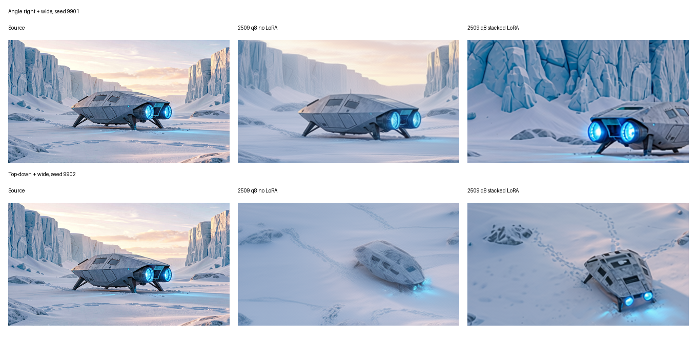
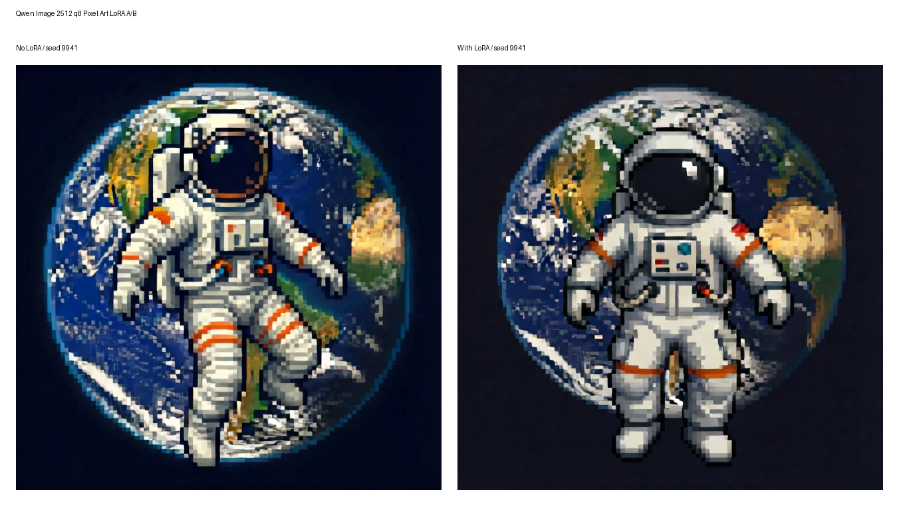
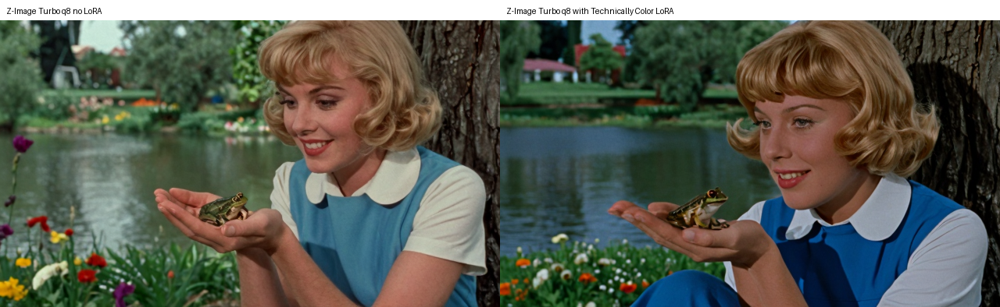
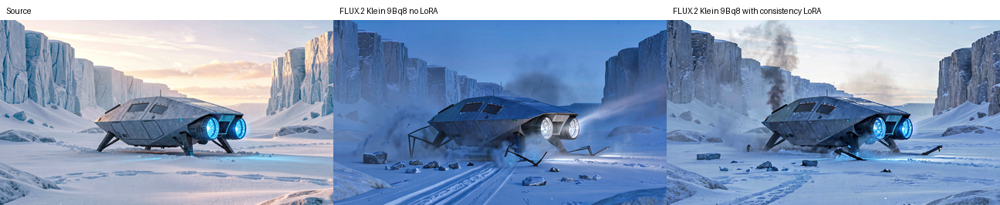
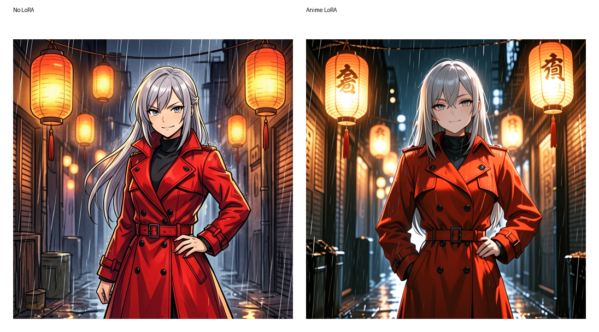

# LoRA

LoRA support in MLX-Gen is experimental. MLX-Gen accepts LoRA adapters only when the selected route
can apply them to the model transformer. A requested LoRA is required input: missing files,
unreadable files, incompatible matrix shapes, zero matched keys, and unsupported model families fail
before or during model setup instead of continuing without the adapter.

## Check Support First

Use `mlxgen capabilities` before starting a LoRA run:

```sh
mlxgen capabilities --model AbstractFramework/flux.2-klein-4b-8bit
```

Each capability row includes:

| Field | Meaning |
| --- | --- |
| `supports_lora` | Whether the route accepts LoRA arguments. |
| `lora_status` | `unsupported`, `mapped-unvalidated`, or `validated`. |
| `lora_target_roles` | Model components targeted by adapters, such as `transformer`. |
| `lora_validation_profile` | Validation profile id when the exact route has model-backed proof. |

`mapped-unvalidated` means MLX-Gen has a loader and mapping for the route, but that exact
model/package and task has not yet passed a visible A/B validation with a public adapter. Treat
LoRA routes as experimental unless a current A/B contact sheet demonstrates the intended adapter
effect for your selected model/package.

Generated output metadata now records what actually applied, not only what was requested:
`lora_application_reports`, `lora_applied_file_count`, and `lora_applied_target_count`.

## Current Support Snapshot

The current LoRA surface is route-specific:

| Route family | Current status |
| --- | --- |
| `AbstractFramework/qwen-image-edit-2511-8bit`, `AbstractFramework/qwen-image-edit-2509-8bit`, `AbstractFramework/qwen-image-2512-8bit`, `AbstractFramework/z-image-turbo-8bit`, `AbstractFramework/flux.2-klein-9b-8bit` edit, `AbstractFramework/ernie-image-turbo-8bit` text-to-image | Exact validated q8 proof rows exist. |
| Base Qwen Image, original Qwen Image Edit, Qwen multi-reference or canvas rows, Z-Image latent img2img, ERNIE latent img2img, and the remaining FLUX.2 package rows | `mapped-unvalidated`: the mapping works, but the exact route still lacks a strong public A/B proof. |
| Wan video, SeedVR2, FIBO | Unsupported today. |
| Bonsai | Unsupported and low priority. The current packed runtime does not expose the ordinary replaceable linear-module boundary that MLX-Gen's LoRA loader requires. |

## Download And Reference Adapters

Generation does not download LoRA files. Download the adapter repository explicitly:

```sh
mlxgen download --model lovis93/Flux-2-Multi-Angles-LoRA-v2 --all-files
```

Use a local `.safetensors` path or a Hugging Face repository id. If the repository contains several
adapter files, specify the file after a colon:

```sh
mlxgen generate \
  --model <compatible-model> \
  --prompt "<prompt from the adapter model card>" \
  --lora-paths owner/repo:adapter.safetensors \
  --lora-scales 0.9 \
  --output with_lora.png
```

The number of `--lora-scales` values must match the number of `--lora-paths` values. Passing scales
without paths fails before model load.

## Adapter Compatibility

Read the adapter model card and match its base model. A LoRA trained for one FLUX.2 variant is not
automatically compatible with another FLUX.2 variant.

The downloaded `lovis93/Flux-2-Multi-Angles-LoRA-v2` adapter targets
`black-forest-labs/FLUX.2-dev`, uses prompts that start with `<sks>`, and recommends adapter
strength around `0.8` to `1.0`. MLX-Gen currently supports FLUX.2 Klein 4B/9B, not
`black-forest-labs/FLUX.2-dev`. Passing this adapter to FLUX.2 Klein is rejected because the LoRA
matrices target a different transformer width.

Wan video LoRA is not supported yet. Unlike Bonsai, Wan is not blocked by a packed execution
boundary: the current MLX Wan transformers still use ordinary MLX linear attention and FFN layers,
and local Diffusers already ships `WanLoraLoaderMixin` plus Wan-specific adapter conversion
helpers. The missing work is Wan-specific adapter-key conversion in MLX-Gen, explicit target-role
handling for TI2V-5B versus dual-transformer A14B routes, the T2V-to-I2V image-projection
expansion policy, and MP4 A/B validation.

The downloaded `fal/Qwen-Image-Edit-2511-Multiple-Angles-LoRA` adapter targets
`Qwen/Qwen-Image-Edit-2511` and uses `<sks>` multi-angle prompt wording. MLX-Gen validates the
adapter against `AbstractFramework/qwen-image-edit-2511-8bit` through the public `mlxgen generate`
route. On the spaceship source below, base Qwen 2511 already follows many viewpoint prompts, so the
LoRA effect is visible but modest.


The first pair used:

```sh
mlxgen generate \
  --model AbstractFramework/qwen-image-edit-2511-8bit \
  --image docs/assets/examples/spaceship-snow/01_t2i_spaceship_snow.png \
  --prompt "Use the source spaceship as the same object. <sks> back view low-angle shot wide shot. Re-render the scene from behind the spaceship at a low camera angle, keeping the icy canyon and the same vehicle design. No text, no watermark, no blur." \
  --negative "front view, same camera angle, cropped spaceship, text, watermark, blur, duplicate spaceship" \
  --width 432 \
  --height 240 \
  --steps 24 \
  --guidance 4 \
  --seed 9701 \
  --metadata \
  --replace \
  --output validation_outputs/lora_multi_angle_2026_06_08/qwen2511_q8_no_lora_back_low_wide.png \
  --i2i-mode edit

mlxgen generate \
  --model AbstractFramework/qwen-image-edit-2511-8bit \
  --image docs/assets/examples/spaceship-snow/01_t2i_spaceship_snow.png \
  --prompt "Use the source spaceship as the same object. <sks> back view low-angle shot wide shot. Re-render the scene from behind the spaceship at a low camera angle, keeping the icy canyon and the same vehicle design. No text, no watermark, no blur." \
  --negative "front view, same camera angle, cropped spaceship, text, watermark, blur, duplicate spaceship" \
  --width 432 \
  --height 240 \
  --steps 24 \
  --guidance 4 \
  --seed 9701 \
  --metadata \
  --replace \
  --output validation_outputs/lora_multi_angle_2026_06_08/qwen2511_q8_with_lora_back_low_wide.png \
  --i2i-mode edit \
  --lora-paths fal/Qwen-Image-Edit-2511-Multiple-Angles-LoRA:qwen-image-edit-2511-multiple-angles-lora.safetensors \
  --lora-scales 0.9
```

The second pair used the same settings with `--prompt "<sks> front view high-angle shot close-up"`,
`--seed 9702`, and matching `no_lora_front_high_close.png` / `with_lora_front_high_close.png`
outputs. The LoRA loader matched and applied all `1,680` adapter tensors for both LoRA runs.

`AbstractFramework/qwen-image-edit-2509-8bit` now has an exact single-image edit proof with the
stacked `lightx2v/Qwen-Image-Lightning` plus `dx8152/Qwen-Edit-2509-Multiple-angles` path. This
row is validated for `qwen.edit` only. The validated profile uses the Lightning-style settings from
the public workflow: `8` steps and `guidance 1`.



Commands:

```sh
mlxgen generate \
  --model AbstractFramework/qwen-image-edit-2509-8bit \
  --image docs/assets/examples/spaceship-snow/01_t2i_spaceship_snow.png \
  --prompt "Move the camera to the right. Rotate the camera 45 degrees to the right. Turn the camera to a wide-angle shot. Keep the same spaceship design, the icy canyon, the rear engines, and the wide scene composition. No text, no watermark, no blur." \
  --width 432 \
  --height 240 \
  --steps 8 \
  --guidance 1 \
  --seed 9901 \
  --metadata \
  --replace \
  --output validation_outputs/lora_strict_2026_06_11/qwen2509_q8_no_lora_angle_g1.png \
  --i2i-mode edit

mlxgen generate \
  --model AbstractFramework/qwen-image-edit-2509-8bit \
  --image docs/assets/examples/spaceship-snow/01_t2i_spaceship_snow.png \
  --prompt "Move the camera to the right. Rotate the camera 45 degrees to the right. Turn the camera to a wide-angle shot. Keep the same spaceship design, the icy canyon, the rear engines, and the wide scene composition. No text, no watermark, no blur." \
  --width 432 \
  --height 240 \
  --steps 8 \
  --guidance 1 \
  --seed 9901 \
  --metadata \
  --replace \
  --output validation_outputs/lora_strict_2026_06_11/qwen2509_q8_with_lora_angle_g1.png \
  --i2i-mode edit \
  --lora-paths /Users/albou/.cache/huggingface/hub/models--lightx2v--Qwen-Image-Lightning/snapshots/e74da8d4e71a54b341de86aa9f8d2509165aa513/Qwen-Image-Edit-2509/Qwen-Image-Edit-2509-Lightning-8steps-V1.0-bf16.safetensors dx8152/Qwen-Edit-2509-Multiple-angles:镜头转换.safetensors \
  --lora-scales 1.0 0.9
```

The corrected MLX-Gen mapping now matches all `1,440` tensors in `镜头转换.safetensors` and all
`2,160` tensors in the stacked Lightning adapter on this route.

`AbstractFramework/qwen-image-2512-8bit` now has an exact text-to-image proof with
`prithivMLmods/Qwen-Image-2512-Pixel-Art-LoRA`. This row is validated for `qwen.text` only; the
latent img2img row remains `mapped-unvalidated`.



Commands:

```sh
mlxgen generate \
  --model AbstractFramework/qwen-image-2512-8bit \
  --prompt "Pixel Art, a pixelated image of a space astronaut floating in zero gravity. The astronaut wears a white spacesuit with orange stripes. Earth appears in the background with blue oceans and white clouds, rendered in classic 8-bit style." \
  --negative " " \
  --width 640 \
  --height 640 \
  --steps 45 \
  --guidance 5 \
  --seed 9941 \
  --metadata \
  --replace \
  --output validation_outputs/lora_strict_2026_06_11/qwen2512_q8_no_lora_pixel_art.png

mlxgen generate \
  --model AbstractFramework/qwen-image-2512-8bit \
  --prompt "Pixel Art, a pixelated image of a space astronaut floating in zero gravity. The astronaut wears a white spacesuit with orange stripes. Earth appears in the background with blue oceans and white clouds, rendered in classic 8-bit style." \
  --negative " " \
  --width 640 \
  --height 640 \
  --steps 45 \
  --guidance 5 \
  --seed 9941 \
  --metadata \
  --replace \
  --output validation_outputs/lora_strict_2026_06_11/qwen2512_q8_with_lora_pixel_art.png \
  --lora-paths prithivMLmods/Qwen-Image-2512-Pixel-Art-LoRA:Qwen-Image-2512-Master-Pixel-Art-LoRA.safetensors \
  --lora-scales 1.0
```

The corrected MLX-Gen Qwen mapping now matches all `1,680` adapter tensors on this route and
applies `840` target layers with no unmatched keys.

`AbstractFramework/z-image-turbo-8bit` now has an exact text-to-image proof with
`renderartist/Technically-Color-Z-Image-Turbo`. This row is validated for `z-image.text` only; the
latent img2img row remains `mapped-unvalidated`.



Commands:

```sh
mlxgen generate \
  --model AbstractFramework/z-image-turbo-8bit \
  --prompt "t3chnic4lly vibrant 1960s close-up of a woman sitting under a tree in a blue skirt and white blouse, she has blonde wavy short hair and a smile with green eyes lake scene by a garden with flowers in the foreground 1960s style film She's holding her hand out there is a small smooth frog in her palm, she's making eye contact with the toad." \
  --negative "JPEG Artifacts, compression, noisy, grainy, low quality, amateur" \
  --width 640 \
  --height 368 \
  --steps 9 \
  --seed 42 \
  --metadata \
  --replace \
  --output validation_outputs/lora_strict_2026_06_11/zimage_q8_no_lora.png

mlxgen generate \
  --model AbstractFramework/z-image-turbo-8bit \
  --prompt "t3chnic4lly vibrant 1960s close-up of a woman sitting under a tree in a blue skirt and white blouse, she has blonde wavy short hair and a smile with green eyes lake scene by a garden with flowers in the foreground 1960s style film She's holding her hand out there is a small smooth frog in her palm, she's making eye contact with the toad." \
  --negative "JPEG Artifacts, compression, noisy, grainy, low quality, amateur" \
  --width 640 \
  --height 368 \
  --steps 9 \
  --seed 42 \
  --metadata \
  --replace \
  --output validation_outputs/lora_strict_2026_06_11/zimage_q8_with_lora.png \
  --lora-paths renderartist/Technically-Color-Z-Image-Turbo:Technically_Color_Z_Image_Turbo_v1_renderartist_2000.safetensors \
  --lora-scales 0.5
```

The LoRA loader matched all `480` adapter tensors and applied `240` target layers.

`AbstractFramework/flux.2-klein-9b-8bit` now has an exact single-image edit proof with
`dx8152/Flux2-Klein-9B-Consistency`. This row is validated for `flux2.edit` only; multi-reference
and reframe/outpaint rows remain `mapped-unvalidated`.



Commands:

```sh
mlxgen generate \
  --model AbstractFramework/flux.2-klein-9b-8bit \
  --image docs/assets/examples/spaceship-snow/01_t2i_spaceship_snow.png \
  --prompt "Edit the source into the same spaceship after a hard landing in the snow at blue hour. Preserve the same spaceship design, hull proportions, cockpit shape, engine placement, snowy canyon layout, and wide camera angle. Add disturbed snow, bent landing struts, a shallow scrape trail, broken ice chunks, and a thin smoke plume. Keep the ship solid, sharp, and consistent." \
  --width 432 \
  --height 240 \
  --steps 20 \
  --guidance 1 \
  --seed 9801 \
  --metadata \
  --replace \
  --output validation_outputs/lora_strict_2026_06_11/flux2_klein9b_q8_no_lora_edit.png

mlxgen generate \
  --model AbstractFramework/flux.2-klein-9b-8bit \
  --image docs/assets/examples/spaceship-snow/01_t2i_spaceship_snow.png \
  --prompt "Edit the source into the same spaceship after a hard landing in the snow at blue hour. Preserve the same spaceship design, hull proportions, cockpit shape, engine placement, snowy canyon layout, and wide camera angle. Add disturbed snow, bent landing struts, a shallow scrape trail, broken ice chunks, and a thin smoke plume. Keep the ship solid, sharp, and consistent." \
  --width 432 \
  --height 240 \
  --steps 20 \
  --guidance 1 \
  --seed 9801 \
  --metadata \
  --replace \
  --output validation_outputs/lora_strict_2026_06_11/flux2_klein9b_q8_with_lora_edit.png \
  --lora-paths dx8152/Flux2-Klein-9B-Consistency:Flux2-Klein-9B-consistency-V2.safetensors \
  --lora-scales 0.8
```

The LoRA loader matched all `224` adapter tensors and applied `144` target layers. On this exact
spaceship edit run, the with-LoRA output stayed materially closer to the source ship layout than the
no-LoRA output while still honoring the crash prompt.

`AbstractFramework/ernie-image-turbo-8bit` now has an exact text-to-image proof with
`reverentelusarca/ernie-image-elusarca-anime-style-lora`. This row is validated for
`ernie-image.text` only; the latent img2img row remains `mapped-unvalidated`.



Commands:

```sh
mlxgen generate \
  --model AbstractFramework/ernie-image-turbo-8bit \
  --prompt "elusarca anime style, a young woman with silver hair and a red trench coat standing beneath glowing lanterns in a rain-soaked alley at night, confident pose, detailed face, dramatic lighting" \
  --negative "blurry, deformed face, extra limbs, text, watermark" \
  --width 512 \
  --height 512 \
  --steps 8 \
  --guidance 1 \
  --seed 9961 \
  --metadata \
  --replace \
  --output validation_outputs/lora_strict_2026_06_11/ernie_turbo_q8_no_lora_anime.png

mlxgen generate \
  --model AbstractFramework/ernie-image-turbo-8bit \
  --prompt "elusarca anime style, a young woman with silver hair and a red trench coat standing beneath glowing lanterns in a rain-soaked alley at night, confident pose, detailed face, dramatic lighting" \
  --negative "blurry, deformed face, extra limbs, text, watermark" \
  --width 512 \
  --height 512 \
  --steps 8 \
  --guidance 1 \
  --seed 9961 \
  --metadata \
  --replace \
  --output validation_outputs/lora_strict_2026_06_11/ernie_turbo_q8_with_lora_anime.png \
  --lora-paths reverentelusarca/ernie-image-elusarca-anime-style-lora:ernie-anime-v1.safetensors \
  --lora-scales 0.9
```

The adapter matched all `504` tensors, applied `252` targets, and produced a visibly stronger anime
render while keeping the same prompt, seed, and subject setup.

Original `AbstractFramework/qwen-image-edit-8bit` and base `AbstractFramework/qwen-image-8bit`
remain experimental. Exact-base public adapters now load cleanly on both routes, but the current
visible A/B proofs are not strong enough yet to promote those exact rows from
`mapped-unvalidated` to `validated`.

## A/B Validation Method

Do not judge a LoRA from a single output. Use the same source, prompt, dimensions, seed, steps, and
guidance with and without the adapter.

For image-to-image LoRAs, keep the source image fixed:

```sh
mlxgen generate \
  --model <compatible-edit-model> \
  --image source.png \
  --prompt "<adapter-specific prompt>" \
  --width 432 \
  --height 240 \
  --steps 24 \
  --guidance 4 \
  --seed 42 \
  --output no_lora.png

mlxgen generate \
  --model <compatible-edit-model> \
  --image source.png \
  --prompt "<adapter-specific prompt>" \
  --width 432 \
  --height 240 \
  --steps 24 \
  --guidance 4 \
  --seed 42 \
  --lora-paths owner/repo:adapter.safetensors \
  --lora-scales 0.9 \
  --output with_lora.png
```

For text-to-image LoRAs, keep the prompt and seed fixed. Use a contact sheet that shows the source
or baseline, the no-LoRA output, and the with-LoRA output side by side. The with-LoRA output should
show the adapter's intended effect while preserving the requested prompt and source constraints.

## Current Experimental Boundaries

- Exact validated rows today are:
  - `AbstractFramework/qwen-image-edit-2511-8bit` on `qwen.edit`;
  - `AbstractFramework/qwen-image-edit-2509-8bit` on `qwen.edit`;
  - `AbstractFramework/qwen-image-2512-8bit` on `qwen.text`;
  - `AbstractFramework/z-image-turbo-8bit` on `z-image.text`;
  - `AbstractFramework/flux.2-klein-9b-8bit` on `flux2.edit`;
  - `AbstractFramework/ernie-image-turbo-8bit` on `ernie-image.text`.
- Adjacent rows remain experimental. That includes Qwen base generation, original Qwen Image Edit,
  Qwen multi-reference, Qwen reframe/outpaint, Z-Image latent img2img, ERNIE latent img2img,
  FLUX.2 multi-reference, and FLUX.2 reframe/outpaint.
- Original `AbstractFramework/qwen-image-edit-8bit` has a clean exact-base adapter candidate in
  `peteromallet/Qwen-Image-Edit-InSubject`, and the loader matches all `1,680` adapter tensors on
  this route with `840` applied targets. The current spaceship A/B is still too weak to promote
  the row, so it remains experimental until a clearer subject-preservation proof exists.
- Original `AbstractFramework/qwen-image-8bit` still has no exact validated text row. The public
  `AbstractFramework/qwen-image-8bit` package is now complete locally, and the exact-base
  `flymy-ai/qwen-image-realism-lora` adapter loads cleanly on the route. It still needs a stronger
  visible A/B before the row can be promoted.
- Bonsai, FIBO, Wan, and SeedVR2 reject LoRA in unified generation. Bonsai stays fail-closed
  because its packed runtime does not expose the normal replaceable linear-module boundary that the
  current LoRA loader requires.
- Video LoRA is tracked separately from image LoRA and is not part of the current unified video
  routes.
- `mlxgen prepare --lora-paths` is rejected until save/reload behavior is proven for the selected
  family and quantization mode.
