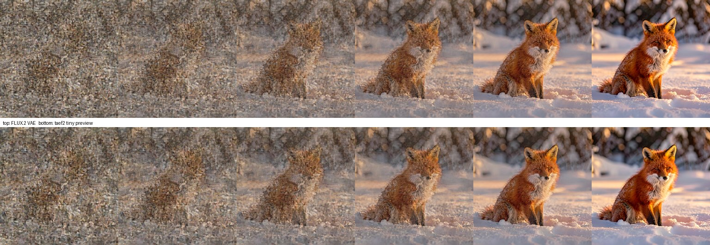
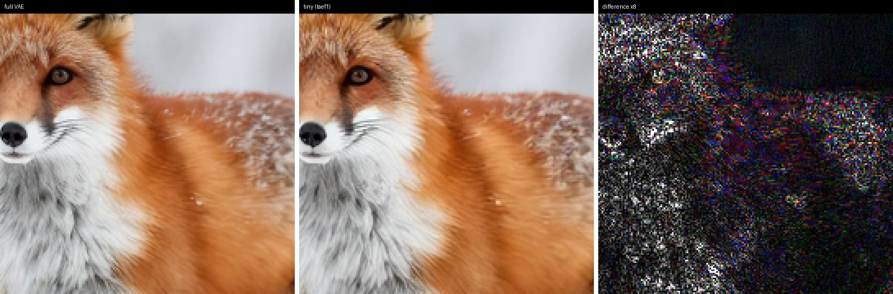

# Generation Previews

A preview is a full-resolution image of a generation in progress, produced by decoding the
latent as it exists at a given denoising step. MLX-Gen can render previews with the model's own
VAE or with a **tiny autoencoder** — a small published decoder for the same latent space that
decodes roughly 11-13x faster. Tiny decoders make continuous previewing practical: rendering
every step costs about 8% extra wall time instead of roughly 86%.

Previews never change what you get. Final outputs are always decoded with the full VAE, and a
run with previews enabled produces a byte-identical image to the same run without them.

## Try It

Download a tiny decoder once, then run the same generation both ways and compare:

```bash
# One-time download of the decoder for the FLUX.1 latent space (used by Z-Image)
mlxgen download --model madebyollin/taef1

# Previews rendered with the tiny decoder
mlxgen generate \
  --model AbstractFramework/z-image-turbo-8bit \
  --prompt "a red fox sitting in deep snow at golden hour, sharp detailed fur" \
  --steps 8 --height 512 --width 512 --seed 42 \
  --preview-decoder tiny \
  --stepwise-image-output-dir ./previews-tiny \
  --output fox-tiny-run.png

# Previews rendered with the model's own VAE
mlxgen generate \
  --model AbstractFramework/z-image-turbo-8bit \
  --prompt "a red fox sitting in deep snow at golden hour, sharp detailed fur" \
  --steps 8 --height 512 --width 512 --seed 42 \
  --preview-decoder full \
  --stepwise-image-output-dir ./previews-full \
  --output fox-full-run.png
```

Each run writes one PNG per step plus a composite strip into its preview directory, and the two
final outputs are identical files. For the FLUX.2 latent space, download `madebyollin/taef2` and
use a FLUX.2 model such as `AbstractFramework/flux.2-klein-4b-8bit`.

| Option | Behavior |
| --- | --- |
| `--preview-decoder auto` | Default. Uses the tiny decoder when one is published for the model's latent space and already downloaded; otherwise previews through the full VAE. |
| `--preview-decoder tiny` | Requires the tiny decoder and reports an error when the family has no mapping or the weights are missing. |
| `--preview-decoder full` | Previews with the model's own VAE. |

## What A Preview Looks Like

Each column below is one denoising step of a single FLUX.2 Klein 4B generation at `512x512`,
6 steps, seed 42. The top row decodes each step with the FLUX.2 VAE, the bottom row decodes the
same latents with `taef2`.



Early steps look like noise in both rows because the latent genuinely is mostly noise at that
point. The two decoders agree more closely as the image forms.

## Preview Fidelity

A preview is a different decoder's rendering of the same latent, not a downscaled final image.
The tiny decoder has roughly 40x fewer parameters than a full VAE decoder and approximates fine
texture.

Measured on Z-Image Turbo at `512x512`, 8 steps, comparing each step's tiny preview against the
full VAE decode of the identical latent:

| Step | Agreement with the full VAE |
| --- | --- |
| 0 (pure noise) | 16.0 dB PSNR |
| 4 | 21.6 dB PSNR |
| 8 (final) | 34.8 dB PSNR, SSIM 0.975, mean color error 0.19/255 |

The same comparison on FLUX.2 Klein 4B holds between 29 and 35 dB across all six steps.

At 1:1 the difference is confined to high-frequency detail. Below is the final image decoded both
ways, magnified 3x, with the difference amplified 8x on the right:



Across that crop the mean difference is 5.0/255, concentrated in fur strands, whisker edges, and
snow speckle. Smooth regions are nearly identical. Composition, pose, color, and lighting are
reproduced faithfully.

Use previews to judge composition, pose, layout, color, and overall direction. Decode the real
output before judging fine detail, faces, small text, seed choice, or LoRA settings.

## Performance

Decode time for a single frame, and end-to-end generation wall time with a preview rendered at
every step. FLUX.2 Klein 4B q8, 6 steps, Apple M5 Max:

| Canvas | Full VAE decode | Tiny decode | Generation, no previews | With tiny previews | With full-VAE previews |
| --- | --- | --- | --- | --- | --- |
| `512x512` | 203 ms | 19 ms | 1.58 s | 2.11 s | 2.83 s |
| `1024x1024` | 860 ms | 68 ms | 6.92 s | 8.65 s | 14.24 s |

Choosing a decoder does not meaningfully change how long a single image takes to produce: both
paths run the same denoising loop and differ only in the final decode. The tiny decoder matters
when a run decodes many times, which is what continuous previewing does.

## Availability

Each entry is enabled after the checkpoint has been verified against that family's own VAE on
real latents. Families that share a VAE share a decoder.

| Family | Latent space | Tiny decoder |
| --- | --- | --- |
| flux (dev, schnell, FLUX.1 variants) | `flux.1` | `madebyollin/taef1` |
| z-image, z-image-turbo | `flux.1` | `madebyollin/taef1` |
| flux2 (Klein 4B/9B and base) | `flux.2` | `madebyollin/taef2` |
| ernie-image, bonsai image | `flux.2` | `madebyollin/taef2` |
| qwen, wan, bernini, fibo | — | full-VAE previews |
| seedvr2 | — | full-VAE previews |

Families without a mapping preview through the full VAE automatically. Mapping is explicit per
latent space and is not inferred from latent-channel count: several families share a channel
count while using different latent semantics, and a mismatched decoder produces a plausible but
wrong image rather than an error.

## Realtime Previews In An Application

Applications that embed MLX-Gen can render live progress by registering an in-loop callback and
decoding each step with the preview decoder. Resolve the decoder once, before generating.

```python
from mflux.models.common.config.model_config import ModelConfig
from mflux.models.common.preview.preview_decoder import PreviewDecoder
from mflux.models.z_image.latent_creator.z_image_latent_creator import ZImageLatentCreator
from mflux.models.z_image.variants.z_image import ZImage
from mflux.utils.image_util import ImageUtil

model = ZImage(
    model_config=ModelConfig.z_image_turbo(),
    model_path="AbstractFramework/z-image-turbo-8bit",
)

# None when no tiny decoder is available for this family; fall back to model.vae.decode.
preview_decoder = PreviewDecoder.resolve(model, mode="auto")


class LivePreview:
    def call_in_loop(self, t, seed, prompt, latents, config, time_steps):
        unpacked = ZImageLatentCreator.unpack_latents(
            latents=latents,
            height=config.height,
            width=config.width,
        )
        decoded = (
            preview_decoder.decode(unpacked, vae=model.vae)
            if preview_decoder is not None
            else model.vae.decode(unpacked)
        )
        frame = ImageUtil.to_pil_image(decoded)
        display(frame)  # hand the PIL image to your UI


model.callbacks.register(LivePreview())
image = model.generate_image(seed=42, prompt="a red fox in snow", num_inference_steps=8, height=512, width=512)
image.save("fox.png")
```

`ImageUtil.to_pil_image` converts decoded latents to a `PIL.Image` without generation metadata,
which is what a preview needs. Use each model family's own latent creator for `unpack_latents`,
and pass `vae=model.vae` so families that pack or patchify their latents are handled correctly.

Previewing every step is the mode tiny decoders are built for. Decoding less often — every few
steps, or only near the end — reduces overhead further and works with either decoder.

## Limits

- Tiny decoders are published per latent space. Families without one preview through the full VAE.
- Previews are approximate by design and are not suitable for final-quality decisions.
- Previews decode the in-flight latent, so early steps show a largely noisy image.
- Preview decoding allocates memory alongside generation: roughly 0.6 GB at `512x512`, 2.0 GB at
  `1024x1024`, and 3.5 GB at `1536x1536`. Preview at a smaller canvas when memory is tight.
- Image tiny decoders reject multi-frame latents rather than previewing only the first frame.
  Video preview support is tracked in [backlog item 0113](backlog/proposed/0113_video_family_tiny_previews.md).

## Implementation

The port follows the reference `taesd.py` and diffusers `AutoencoderTiny` graph layer for layer.
The MLX deviation is layout only: convolutions run channels-last, with a transpose at the entry
and exit of the decoder rather than around every convolution. Decoded output matches the torch
reference to within that reference's own float32 accumulation noise, at most one 8-bit level
after quantization.

Tiny decoders consume the diffusion model's in-flight latents directly. The scale, shift, and
per-channel normalization a full VAE applies inside `decode` are intentionally skipped, because
these checkpoints are trained on model-space latents. Where a family packs or patchifies its
latents, its VAE exposes `to_preview_latents` to undo only the packing.
