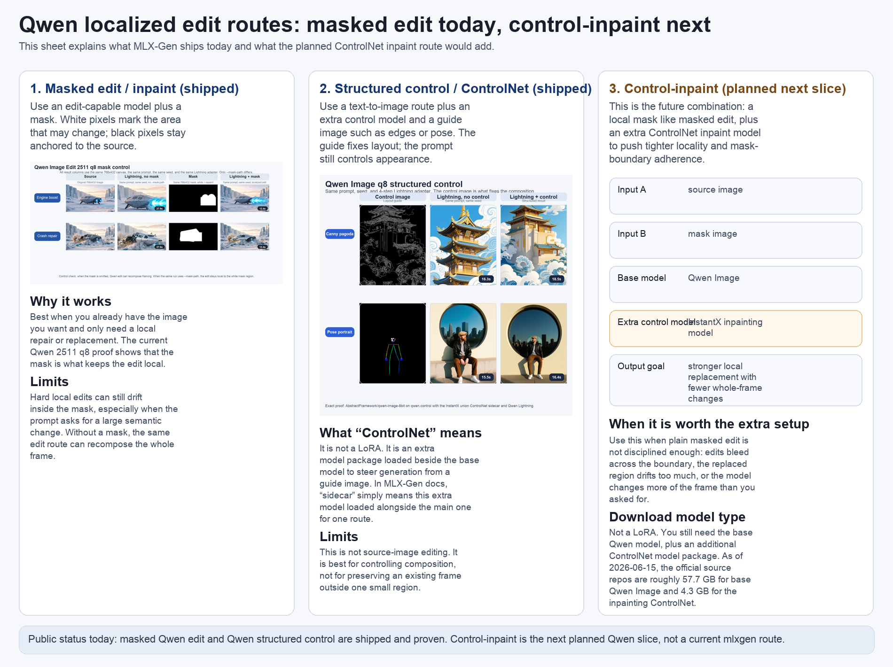

# Qwen Localized Editing

MLX-Gen currently ships two different Qwen workflows that people can confuse easily:

- masked edit / inpaint on the Qwen edit route;
- structured control on the base Qwen route.

The next planned Qwen slice is **control-inpaint**, which combines parts of both ideas. This page
explains the difference in plain language.

## Current Status

What MLX-Gen supports today:

- `AbstractFramework/qwen-image-edit-2511-8bit` on `qwen.inpaint`
- `AbstractFramework/qwen-image-8bit` on `qwen.control`

What MLX-Gen does **not** support yet:

- base-Qwen control-inpaint with `InstantX/Qwen-Image-ControlNet-Inpainting`

So if you are reading about control-inpaint below, treat it as the **next planned route**, not a
current `mlxgen generate` capability.

## One-Sentence Difference

- **Masked edit / inpaint** means: start from an existing image and change only the white masked
  region.
- **Structured control** means: generate from text, but force the layout with a guide image such as
  edges or pose.
- **Control-inpaint** means: still edit only one masked region, but add an extra control model to
  make that local replacement more disciplined.

## Comparison Sheet

Use this sheet as a route guide:

- left panel: what MLX-Gen ships today for localized Qwen edit;
- middle panel: what MLX-Gen ships today for Qwen structured control;
- right panel: what the planned control-inpaint route would add.

The left and middle panels use real current proof assets. The right panel is an explanatory route
diagram because control-inpaint is not yet implemented in MLX-Gen.

## What “ControlNet” Means

For MLX-Gen users, the practical definition is simple:

- a **ControlNet** is an extra model package that guides the base image model;
- it is **not** a LoRA;
- it is **not** a replacement for the base model;
- it is loaded **alongside** the base model for a specific route.

When MLX-Gen docs say **sidecar**, they mean exactly that: an extra model package loaded beside the
main model for one route.

So:

- base Qwen model = the main generator;
- ControlNet model = extra guidance model for one kind of request.

## What The Current Masked Edit Route Does

Current shipped route:

- model family: `Qwen Image Edit`
- exact public proof row: `AbstractFramework/qwen-image-edit-2511-8bit`
- capability id: `qwen.inpaint`

User-facing inputs:

- one source image with `--image`;
- one mask image with `--mask-path`;
- one prompt;
- optional negative prompt;
- optional Lightning adapter for the fast `4`-step path.

Best use:

- repair one damaged region;
- replace one local object area;
- intensify or redraw one local feature;
- preserve the existing framing and background outside the mask.

Weakness:

- hard local edits can still drift inside the masked region;
- without the mask, the same edit route can recompose the whole frame;
- it is not the best tool when you want a separate guide image to control layout.

## What The Current Structured Control Route Does

Current shipped route:

- model family: base `Qwen Image`
- exact public proof row: `AbstractFramework/qwen-image-8bit`
- capability id: `qwen.control`
- exact control model: `InstantX/Qwen-Image-ControlNet-Union:diffusion_pytorch_model.safetensors`

User-facing inputs:

- prompt;
- one control image with `--controlnet-image-path`;
- optional negative prompt;
- optional Lightning adapter for the fast `4`-step path.

Best use:

- keep a canny/sketch/pose-like layout;
- generate from text while anchoring geometry;
- control composition without editing an existing source frame.

Weakness:

- this is not a source-image edit route;
- it is weaker for “keep this exact frame, only repair this small region” tasks;
- it is a control workflow, not a localized edit workflow.

## What Control-Inpaint Would Add

Planned next slice:

- model family: base `Qwen Image`
- planned extra control model: `InstantX/Qwen-Image-ControlNet-Inpainting`

The user intent is still familiar:

- start from an existing image;
- provide a mask;
- describe what should appear inside that region.

The difference is backend behavior:

- current masked edit uses the Qwen edit model with mask-localized editing;
- control-inpaint would use the base Qwen model plus an extra inpainting control model.

The expected benefit is not “a brand-new type of prompt.” The expected benefit is:

- tighter mask-boundary adherence;
- fewer unintended whole-frame changes on difficult local edits;
- stronger control when plain masked edit is not disciplined enough.

This means control-inpaint is **not automatically better** than the current masked route.

Use the current masked route when:

- the edit is straightforward;
- you want the smallest setup;
- the existing qwen.inpaint route already keeps the change local enough.

Control-inpaint becomes interesting when:

- plain masked edit bleeds across the mask boundary;
- the replaced region drifts too much;
- the model changes more of the frame than you asked for.

## Is Control-Inpaint Better?

Not universally.

The practical answer is:

- **simpler localized repair**: current masked edit is often enough;
- **hard localized replacement**: control-inpaint is likely to be better if the base masked route
  is not disciplined enough.

So the global opinion should be framed as:

- not “better everywhere”;
- better when locality and boundary discipline matter more than minimal setup.

## Is It A LoRA?

No.

`InstantX/Qwen-Image-ControlNet-Inpainting` is not a LoRA adapter. It is a separate control-model
package.

In practical terms, that means:

- you still need the base Qwen model;
- you also need the additional ControlNet model package;
- this is a heavier setup than attaching one LoRA file.

So the download shape is:

1. base Qwen model;
2. extra ControlNet model.

That is different from:

1. base model;
2. one LoRA adapter file.

## Related Docs

- [Image edit modes](image-edit-modes.md)
- [Image edit capabilities](edit-capabilities.md)
- [LoRA](lora.md)
- [FAQ](faq.md)
