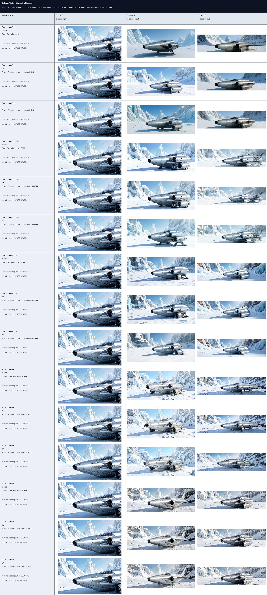

# Reframe And Outpaint

MLX-Gen exposes two single-image canvas expansion workflows through `mlxgen generate`:

- `--reframe-padding` asks an edit model to generate a wider view from the source image. The model
  can redraw the source while changing the crop, viewpoint, or visible subject boundary.
- `--outpaint-padding` expands one source image into a larger canvas and then uses the selected
  edit backend to fill only the added border area as faithfully as that backend allows.

Both options use CSS-style padding in `top,right,bottom,left` order. Percentages are relative to
the source image size. For example, `5%,80%,5%,60%` adds a small top/bottom border, more space to
the right, and a large extension to the left.

`--reframe-padding` is always a generative edit workflow. `--outpaint-padding` is backend-specific:
Qwen Image Edit still uses generative canvas expansion with adaptive source restoration, while
FLUX.2 Klein now routes strict outpaint only through base Klein models with source-locked denoising
and a narrow transition band inside the source crop. Neither route is a native masked fill/inpaint
pipeline, so review the output visually.

## Supported Models

The historical mixed validation profile is `reframe_outpaint_2026_06_08`. It uses one cropped
starship source image. Treat the distilled FLUX.2 outpaint rows in that profile as historical
artifacts only; they are no longer the current FLUX.2 outpaint contract. Current source-model
FLUX.2 Klein base proof is published separately as `flux2_klein_base_starship_2026_06_10`.

| Family | Reframe | Outpaint | Notes |
| --- | --- | --- | --- |
| Qwen Image Edit / 2509 / 2511 | current | current | Published `reframe_outpaint_2026_06_08` profile remains representative for the base route. Exact 2511 q8 LoRA-backed reframe and outpaint rows are published separately in [LoRA](lora.md). |
| FLUX.2 Klein 4B / 9B distilled | current | historical only | Reframe remains supported. Historical outpaint rows are stale and are no longer exposed as strict outpaint. |
| FLUX.2 Klein Base 4B / 9B | not exposed | current | Strict FLUX.2 outpaint now requires a base Klein model. Source-model contact sheets are published, and the exact `AbstractFramework/flux.2-klein-base-4b-8bit` q8 LoRA-backed outpaint row is published separately in [LoRA](lora.md). |

These options are intentionally not exposed for base Qwen Image, Qwen Image 2512, ERNIE Image
Turbo, Z-Image, FIBO, Bonsai, Wan, or SeedVR2. Those families are text generation, latent I2I,
video, upscale/restoration routes, or do not yet have a validated edit-reference canvas-expansion
profile.

Check support before running:

```sh
mlxgen capabilities --model AbstractFramework/qwen-image-edit-2511-8bit
```

Inspect the June 8 mixed-profile validation records for a package:

```sh
mlxgen validation \
  --profile reframe_outpaint_2026_06_08 \
  --model AbstractFramework/qwen-image-edit-2511-8bit
```

Inspect the current base-source starship validation records:

```sh
mlxgen validation \
  --profile flux2_klein_base_starship_2026_06_10 \
  --model black-forest-labs/FLUX.2-klein-base-9B
```

## Reframe Example

Use reframe when you want a model to create a wider view and you accept that the source may be
redrawn:

```sh
mlxgen generate \
  --model AbstractFramework/flux.2-klein-4b-8bit \
  --image input.png \
  --reframe-padding "25%,50%,25%,50%" \
  --prompt "Generatively reframe this close-up into a wider establishing shot. Reveal the full subject and extend the background naturally." \
  --steps 16 \
  --seed 42 \
  --output reframed.png
```

## Outpaint Example

Use outpaint when you want MLX-Gen to expand one source image while keeping the original crop as
stable as the backend allows:

```sh
mlxgen generate \
  --model black-forest-labs/FLUX.2-klein-base-9B \
  --image input.png \
  --outpaint-padding "5%,80%,5%,60%" \
  --prompt "Outpaint this close crop into a wider realistic shot. Complete the missing subject and background outside the original frame." \
  --steps 20 \
  --guidance 4 \
  --seed 42 \
  --output outpaint.png
```

For Qwen Image Edit variants, MLX-Gen may still apply adaptive source restoration after generation.
For current FLUX.2 Klein base outpaint, MLX-Gen relies on source-locked denoising with an interior
transition band instead of pasting the original crop back over the final image.

## Validation Assets

The current proof set uses this source image:


The outpaint helper creates this wider conditioning canvas and source-window mask:


In the mask image, black marks the original source window and white marks the generated border area.


The summary sheet shows the historical 2026-06-08 source/q8/q4 rows:



Per-family contact sheets:

- [Qwen Image Edit](assets/validation/reframe-outpaint-2026-06-08/qwen-image-edit-reframe-outpaint-matrix.jpg)
- [Qwen Image Edit 2509](assets/validation/reframe-outpaint-2026-06-08/qwen-image-edit-2509-reframe-outpaint-matrix.jpg)
- [Qwen Image Edit 2511](assets/validation/reframe-outpaint-2026-06-08/qwen-image-edit-2511-reframe-outpaint-matrix.jpg)
- [FLUX.2 Klein 4B](assets/validation/reframe-outpaint-2026-06-08/flux2-klein-4b-reframe-outpaint-matrix.jpg) - historical distilled reframe/outpaint matrix
- [FLUX.2 Klein 9B](assets/validation/reframe-outpaint-2026-06-08/flux2-klein-9b-reframe-outpaint-matrix.jpg) - historical distilled reframe/outpaint matrix

Current source-model FLUX.2 Klein base proof:

- [Base 4B/9B edit and strict-outpaint matrix](assets/validation/flux2-klein-base-starship-2026-06-10/flux2-klein-base-starship-edit-matrix.jpg)
- [Base 4B/9B strict-outpaint seam review](assets/validation/flux2-klein-base-starship-2026-06-10/flux2-klein-base-starship-outpaint-seams.jpg)
- [Base 4B/9B text-to-image smoke panel](assets/validation/flux2-klein-base-starship-2026-06-10/flux2-klein-base-starship-t2i-panel.jpg)

The exact commands and validation manifest are published with the assets:

- [Command log](assets/validation/reframe-outpaint-2026-06-08/reframe-outpaint-command-log.md)
- [Validation manifest](assets/validation/reframe-outpaint-2026-06-08/reframe-outpaint-validation-manifest.json)
- [Base starship command log](assets/validation/flux2-klein-base-starship-2026-06-10/flux2-klein-base-starship-command-log.md)
- [Base starship validation manifest](assets/validation/flux2-klein-base-starship-2026-06-10/flux2-klein-base-starship-validation-manifest.json)
