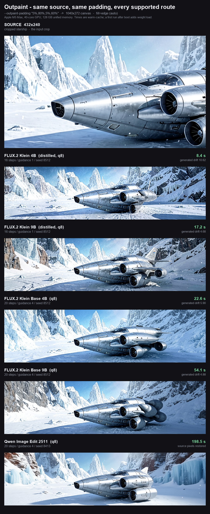
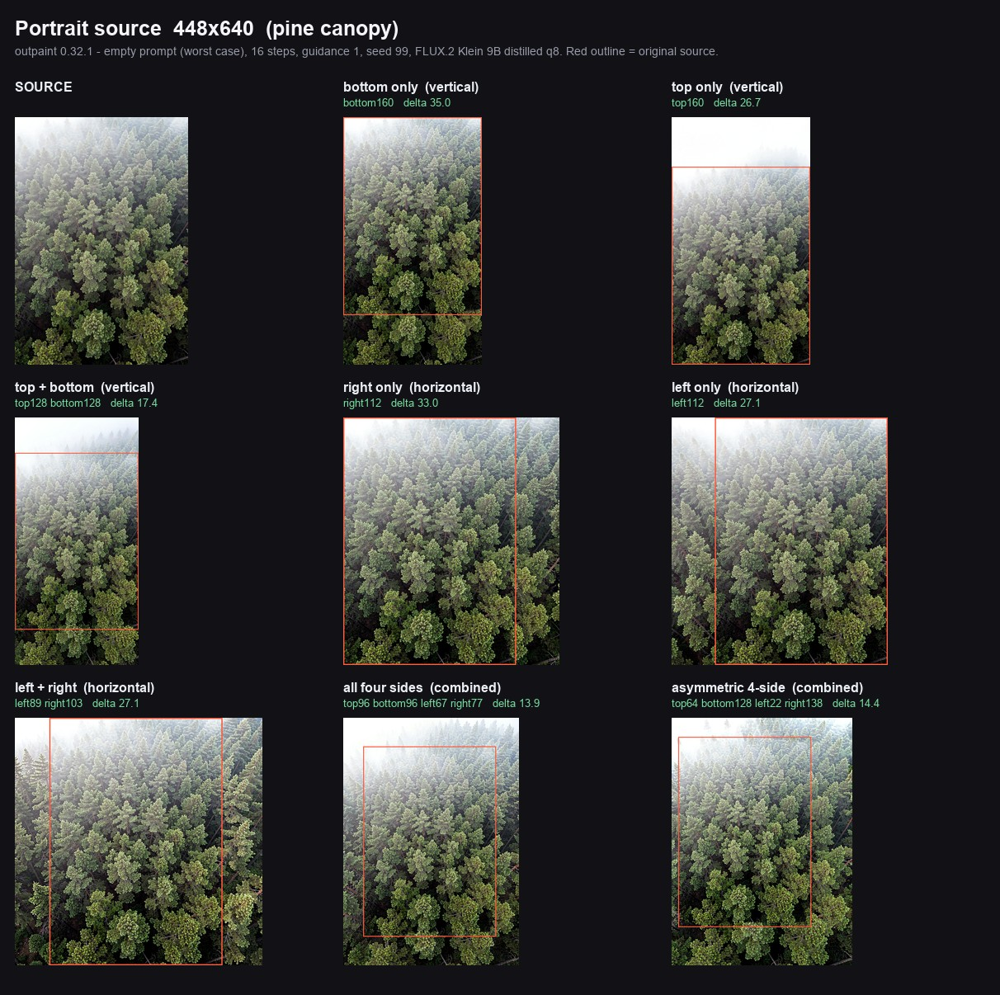
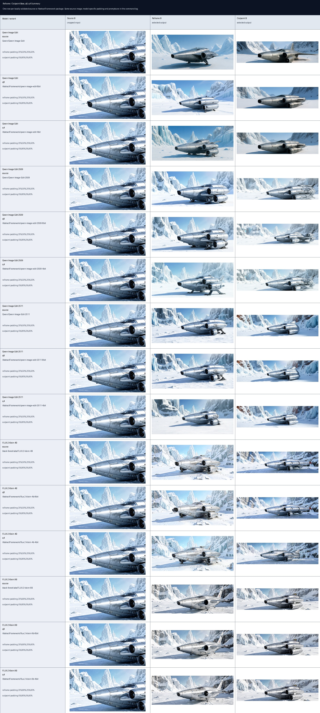

# Reframe And Outpaint

MLX-Gen exposes two single-image canvas expansion workflows through `mlxgen generate`:

- `--reframe-padding` asks an edit model to generate a wider view from the source image. The model
  can redraw the source while changing the crop, viewpoint, or visible subject boundary.
- `--outpaint-padding` expands one source image into a larger canvas and then uses the selected
  edit backend to fill only the added border area as faithfully as that backend allows.

Both options use CSS-style padding in `top,right,bottom,left` order. Percentages are relative to
the source image size. For example, `5%,80%,5%,60%` adds a small top/bottom border, more space to
the right, and a large extension to the left.

Each side is independent, and `0` leaves that edge where it is. One call can therefore extend a
single side, both sides of an axis, or all four at different depths — see
[Expanding On Any Side](#expanding-on-any-side) for coverage across three source aspect ratios.

`--reframe-padding` is always a generative edit workflow. `--outpaint-padding` is backend-specific:
Qwen Image Edit uses generative canvas expansion with adaptive source restoration, while every
FLUX.2 Klein model — distilled 4B/9B and base 4B/9B alike — runs strict outpaint with source-locked
denoising and a narrow transition band inside the source crop. Neither route is a native masked
fill/inpaint pipeline, so review the output visually.

## The Conditioning Canvas

Outpaint pastes your source onto a larger canvas and asks the model to complete the added area, so
what fills that area *before* denoising decides what you get back. On FLUX.2 Klein you choose that
with `--outpaint-fill`:

| Mode | What it paints | Use it when |
| --- | --- | --- |
| `auto` (default) | Picks one of the modes below from the padding depth and the loaded adapter, and prints which and why. | You want a sensible canvas without thinking about it. |
| `edge` | Stretches the source border strip outward. | You are continuing an existing texture across a border within the edge-fill reach. |
| `neutral` | A flat per-side border color sampled from the source. | You are adding a lot of space and want the model to invent new subject matter. |
| `solid` | One flat color, from `--outpaint-fill-color`. | You need an exact canvas color, for example an adapter trained on one. |
| `blur` | A blurred, scaled copy of the source. | You want a soft background suggestion rather than a blank one. |

Edge fill continues a texture; it does not invent one. It works by stretching a source border strip
across the padded area, so it holds up while the padding stays within what that strip covers — the
**edge-fill reach**, printed for every run. Past the reach the strip is stretched far enough that it
reads as directional streaks rather than continued texture, so `auto` switches to `neutral` there:
a blank canvas gives the model nothing to continue and it generates instead.

`auto` also switches to `solid` green when a green-border outpaint adapter is loaded, because those
adapters are trained to paint into a pure-green canvas.

Every outpaint run prints its resolved canvas:

```
Outpaint: fill=neutral, canvas 928x1536 from source 768x766, padding top=0 right=76 bottom=766 left=76.
Outpaint: --outpaint-fill auto selected neutral because the deepest padding is bottom 766px (100% of
the source height), 2.0x the 384px edge-fill reach; the fill conditions the seam around the source
rather than the padded region, and a blank seam does not hand the model a stretched border strip to
continue.
```

Applications can read the same contract as JSON without running a job — `outpaint_fill_modes`,
`outpaint_default_fill_mode`, `outpaint_auto_edge_fill_max_stretch`, `outpaint_recommended_lora`,
and the validated envelope are published on the capability record. See
[Edit Capabilities](edit-capabilities.md).

## Choosing Padding

Padding is the single biggest factor in outpaint quality. Two guidelines:

- **Extend in steps rather than in one jump.** Two passes of 50-70% give the model a nearby edge to
  continue from each time, and each pass runs on a smaller canvas. A request that pads both axes
  deeply is split into two single-axis passes for you (see below).
- **Watch the canvas size.** Outpaint conditioning tokens scale with the canvas, and attention cost
  grows faster than area. A 1.4 MP canvas costs substantially more per step than a 0.3 MP one.

For revealing a subject the source crop never showed — a full body from a head-and-shoulders
portrait, for example — `neutral` fill with a descriptive prompt is the route that generates new
subject matter. A blank canvas gives the model room to invent but little guidance on where the
subject continues, so at very deep padding the new content can sit away from the source edge. The
outpaint adapter in [LoRA](lora.md) is the recommended configuration for this case and holds the
continuation to the source; extending in two moderate passes helps for the same reason.

### Deep Padding On Two Axes

Padding a vertical side *and* a horizontal side deeply in the same request opens a free corner — a
block of new canvas that shares neither a row nor a column with your source. Nothing local anchors
that corner: every source token the model can attend to sits diagonally away from it, so the prompt
and the model's prior fill it, and what they paint there is a second copy of the subject. Measured
on the starship source with distilled 9B at 16 steps, three seeds per geometry, with a prompt that
names the subject: corners of 20%, 25% and 30% on both axes are clean on every seed, 40% grows a
second hull on one seed, and 50% and 60% duplicate on two to three seeds each
([sweep sheet](assets/validation/outpaint-two-pass-2026-09-02/corner-sweep-9b-distilled.jpg)).
Single-axis expansion of the same depth on the same seeds is clean, and so are four shallow sides at
once; see [Expanding On Any Side](#expanding-on-any-side).

So `--outpaint-padding` runs such a request as **two single-axis passes**: the deeper axis first
on your source, then the other axis on that output. Every new cell then shares a row or a column
with real content at each pass, the final canvas is exactly the one-pass canvas, and the run prints
what it is doing:

```text
Outpaint: 2 passes because the request pads bottom 148px (62% of the source height) and right 256px
(59% of the source width), which opens a 256x160px free corner past the 30% auto-split depth, and a
free corner is where the model paints a second copy of the subject; two single-axis passes reach the
same canvas with no free corner at either pass. Pass 1 pads 0,0,148,0 to 432x400; pass 2 pads
0,256,0,0 to 688x400.
```

`--outpaint-passes` controls this: `auto` (default) splits when the shallower of the two axis
depths exceeds the route's published `outpaint_auto_split_corner_ratio` (30% on every current
route), `2` splits any request that pads both axes, and `1` forces a single canvas and prints a
warning naming the corner instead. On the geometry that duplicated on three of three seeds in one
pass, the split is clean on three of three in both mirror orientations
([two-pass sheet](assets/validation/outpaint-two-pass-2026-09-02/two-pass-9b-distilled.jpg)).

Every outpaint route on that geometry, split by `auto`, two seeds each
([model matrix sheet](assets/validation/outpaint-two-pass-2026-09-02/model-matrix.jpg), commands in the
[log](assets/validation/outpaint-two-pass-2026-09-02/two-pass-command-log.md)):

| Route | Passes | Duplicated |
| --- | --- | --- |
| FLUX.2 Klein 4B distilled q8, 16 steps, guidance 1 | 2 (auto) | 0 of 2 |
| FLUX.2 Klein 9B distilled q8, 16 steps, guidance 1 | 2 (auto) | 0 of 3, both mirror orientations |
| FLUX.2 Klein Base 4B q8, 20 steps, guidance 4 | 2 (auto) | 0 of 2 |
| FLUX.2 Klein Base 4B q8, 20 steps, guidance 4 | 1 (`--outpaint-passes 1`, control) | 1 of 2 |
| FLUX.2 Klein Base 9B q8, 20 steps, guidance 4 | 2 (auto) | 0 of 2 |
| Qwen Image Edit 2511 q8, 20 steps, guidance 4 | 2 (auto) | 0 of 1 |

Every row ends with the original crop restored. The Qwen row runs with the same subject-naming
prompt and no `--negative`; holding the source in latent space is what keeps a prompt asking for
*a wider shot* from recomposing it
([sheet](assets/validation/outpaint-two-pass-2026-09-02/qwen-source-lock.jpg), which also shows
the recorded validation envelope on the same route: drift 1.37 underneath, original restored). On
distilled 9B the split measures 7.8 and 4.4 underneath its two passes and 6.7 against the original
([sheet](assets/validation/outpaint-two-pass-2026-09-02/base-negative-prompt.jpg), last row).

A negative prompt is not a substitute for the split. Base Klein and Qwen accept one, and it steers
what the model paints, but on the same geometry in a single pass base 4B still grew a second hull
on one of two seeds with
`--negative "a second spacecraft, duplicate ship, two ships, repeated hull, extra fuselage"`
(the same sheet, first two rows). Use it for content; let the pass planner remove the corner.

Two things to know about a split run:

- **It costs a second denoise.** Every route restores its source after each pass, so your original
  pixels come through a split run as they do a single one; the metadata records what each pass
  drew underneath (`outpaint_pass_source_restore_differences`) and whether its restore applied.
- **Prompt content still matters.** The source already conditions the model on the subject, so a
  prompt that names it again asks for one in the new space. Describe the area being added (*"a
  wide snowy canyon, deep snow field in the foreground, ice cliffs receding into haze"*) rather
  than the subject. Raising `--steps` does not move duplication: it was measured at 16, 32 and 48
  steps on every seed.

`--outpaint-fill` is not the lever here on FLUX.2 Klein. Those routes lock the source in latent
space and condition on the seam around it, so the fill decides what the seam sees and never reaches
the free corner. FLUX.2 Klein base models and Qwen Image Edit accept `--negative`, which is where
duplicate-subject wording belongs; distilled Klein has no guidance branch and rejects it.

## Supported Models

| Family | Reframe | Outpaint | Notes |
| --- | --- | --- | --- |
| Qwen Image Edit / 2509 / 2511 | supported | supported | Generative canvas expansion with adaptive source restoration, on the route's fixed `edge` canvas. Exact 2511 q8 LoRA-backed reframe and outpaint rows are published in [LoRA](lora.md). |
| FLUX.2 Klein 4B / 9B distilled | supported | supported | Strict outpaint at guidance 1.0; these weights are step-distilled and do not take CFG. Evidence: `flux2_klein_outpaint_latent_lock_2026_09_01`. |
| FLUX.2 Klein Base 4B / 9B | not exposed | supported | Strict outpaint at guidance 4.0 (true CFG). The exact `AbstractFramework/flux.2-klein-base-4b-8bit` q8 LoRA-backed outpaint row is published in [LoRA](lora.md). |

These options are intentionally not exposed for base Qwen Image, Qwen Image 2512, ERNIE Image
Turbo, Z-Image, FIBO, Bonsai, Wan, or SeedVR2. Those families are text generation, latent I2I,
video, upscale/restoration routes, or do not yet have a validated edit-reference canvas-expansion
profile.

Check support before running:

```sh
mlxgen capabilities --model AbstractFramework/qwen-image-edit-2511-8bit
```

Three validation profiles cover these workflows, all on the same cropped starship source image:

| Profile | Covers |
| --- | --- |
| `reframe_outpaint_2026_06_08` | Qwen reframe and outpaint rows, and FLUX.2 Klein distilled reframe rows. Its distilled outpaint artifacts are retained as historical evidence for the edit path with adaptive source blending. |
| `flux2_klein_base_starship_2026_06_10` | FLUX.2 Klein base source-model latent I2I, edit, multi-reference and strict outpaint. |
| `flux2_klein_outpaint_latent_lock_2026_09_01` | FLUX.2 Klein distilled 4B/9B q8 strict outpaint, with a base 4B q8 control at identical settings. |

```sh
mlxgen validation \
  --profile flux2_klein_outpaint_latent_lock_2026_09_01 \
  --model AbstractFramework/flux.2-klein-4b-8bit
```

## What Each Model Produces

Every supported route, run on one source image with one padding value. The source is a 432x240
crop of a starship in a snowy canyon; `--outpaint-padding "5%,80%,5%,60%"` expands it to a
1040x272 canvas, adding most of the new space on the left and right so the model has to invent the
rest of the ship and the surrounding valley.



The prompt, used for all four FLUX.2 Klein rows:

```text
Outpaint this close cropped starship image into a much wider realistic shot of the full
spacecraft in the snowy canyon. Keep the existing compact silver spacecraft consistent, complete
the missing nose, rounded hull, short tail, twin round rear engines, snow field, and ice cliffs in
the newly added space. The entire ship must fit inside the final wide frame. No duplicated
spacecraft, no repeated mountains, no text, no border.
```

Measured on an Apple M5 Max, 40-core GPU, 128 GB unified memory. `--outpaint-fill auto` resolved
to `edge` on every row, because the deepest padded side (345 px) is inside the 384 px edge-fill
reach for this source.

| Model | Steps | Guidance | Time | Generated drift | Source region in output |
| --- | --- | --- | --- | --- | --- |
| FLUX.2 Klein 4B distilled q8 | 16 | 1 | **8.4 s** | 10.62 | original pixels restored |
| FLUX.2 Klein 9B distilled q8 | 16 | 1 | 17.2 s | **4.68** | original pixels restored |
| FLUX.2 Klein Base 4B q8 | 20 | 4 | 22.6 s | 5.90 | original pixels restored |
| FLUX.2 Klein Base 9B q8 | 20 | 4 | 54.1 s | 4.88 | original pixels restored |
| Qwen Image Edit 2511 q8 | 20 | 4 | 198.5 s | 9.35 | original pixels restored |

Time is the whole command with a warm weight cache; a first run after boot adds weight-load time.

**Generated drift** is the mean absolute difference (0-255) between your original crop and the same
region as the model generated it, recorded in every run's metadata as
`outpaint_source_restore_difference`. It is measured **before** the restore, so it describes what
the model drew underneath rather than what you get: every route holds the source in latent space
while it generates, then compares that figure against the restore threshold (24) and pastes your
original crop back over the result when it passes, which it did on every row
(`outpaint_source_restore_applied: true`). Lower drift means the seam the transition band
regenerates has less to reconcile.

How to read this if you are choosing a route:

- **Distilled Klein 4B is by far the fastest** and runs at guidance 1, because those weights are
  step-distilled. It is the route to reach for first.
- **Use `--negative` where you have it.** FLUX.2 Klein base models and Qwen Image Edit accept a
  negative prompt, and the Qwen row above uses one to stop the model growing aircraft wings.
  Qwen's cost is speed: roughly 4-6x the FLUX.2 routes here.
- **The 9B models hold the source closest underneath**, distilled 9B most of all, so their seams
  have the least to reconcile; distilled 4B trades the most of that for its speed.
- Every route completed the ship and the valley without a visible seam at the original crop
  boundary.

Reproduce any row from the
[command log](assets/validation/outpaint-model-matrix-2026-09-01/outpaint-model-matrix-command-log.md);
the measurements are in
[stats](assets/validation/outpaint-model-matrix-2026-09-01/outpaint-model-matrix-stats-m5max.json).

## Expanding On Any Side

Padding is independent per side, so a single request can extend one edge, both edges of an axis,
or all four at once. Coverage across three source aspect ratios and eight padding configurations:

| | |
| --- | --- |
| [Landscape 640x448](assets/validation/outpaint-axis-coverage-2026-09-02/axis-coverage-landscape.jpg) | [Square 512x512](assets/validation/outpaint-axis-coverage-2026-09-02/axis-coverage-square.jpg) |
| [Portrait 448x640](assets/validation/outpaint-axis-coverage-2026-09-02/axis-coverage-portrait.jpg) | [Measurements](assets/validation/outpaint-axis-coverage-2026-09-02/axis-coverage-measurements.txt) |



Each sheet runs one source through: every single side, both vertical sides together, both
horizontal sides together, all four sides, and an asymmetric four-side request. The red outline
marks the original source, so everything outside it is generated. These runs use an **empty
prompt** deliberately — with no instruction the model has the least to work from, so it is the
hardest case; a descriptive prompt gives better results, not worse.

The measurement beside each result is the mean absolute difference between the generated band and
the conditioning canvas the model was given for it. It answers one question: did the model invent
this region, or hand back the canvas? Reproduce any row from the
[command log](assets/validation/outpaint-axis-coverage-2026-09-02/axis-coverage-command-log.md).

## Reframe Example

Use reframe when you want a model to create a wider view and you accept that the source may be
redrawn:

```sh
mlxgen generate \
  --model AbstractFramework/flux.2-klein-4b-8bit \
  --image input.png \
  --reframe-padding "25%,50%,25%,50%" \
  --prompt "Generatively reframe this close-up into a wider establishing shot. Reveal the full subject and extend the background naturally." \
  --steps 16 \
  --seed 42 \
  --output reframed.png
```

## Outpaint Example

Use outpaint when you want MLX-Gen to expand one source image while keeping the original crop as
stable as the backend allows:

```sh
mlxgen generate \
  --model black-forest-labs/FLUX.2-klein-base-9B \
  --image input.png \
  --outpaint-padding "5%,80%,5%,60%" \
  --prompt "Outpaint this close crop into a wider realistic shot. Complete the missing subject and background outside the original frame." \
  --steps 20 \
  --guidance 4 \
  --seed 42 \
  --output outpaint.png
```

Distilled Klein runs the same route in fewer steps and at guidance 1.0:

```sh
mlxgen generate \
  --model AbstractFramework/flux.2-klein-4b-8bit \
  --image input.png \
  --outpaint-padding "5%,80%,5%,60%" \
  --prompt "Outpaint this close crop into a wider realistic shot. Complete the missing subject and background outside the original frame." \
  --steps 16 \
  --guidance 1 \
  --seed 42 \
  --output outpaint.png
```

Guidance is the one setting that does not carry across the two weight families. Omit `--guidance`
and each model takes its own default; passing a value above 1.0 to distilled Klein is rejected
before the weights load.

A request that pads both axes deeply runs as two single-axis passes by default; pass
`--outpaint-passes 1` to force one canvas or `--outpaint-passes 2` to split any two-axis request.
See [Deep Padding On Two Axes](#deep-padding-on-two-axes).

To add a lot of space on one side — extending a portrait downward to reveal more of the subject —
pass the padding on that side and let `auto` pick the blank canvas, or name it explicitly:

```sh
mlxgen generate \
  --model AbstractFramework/flux.2-klein-base-4b-8bit \
  --image portrait.png \
  --outpaint-padding "0%,10%,100%,10%" \
  --outpaint-fill neutral \
  --prompt "Extend this portrait downward to reveal the lower part of the body: the same subject in the same clothing, same lighting, same background." \
  --steps 20 \
  --guidance 4 \
  --seed 1234 \
  --output extended.png
```

`--outpaint-padding` computes the output size from the source and the padding, so do not pass
`--width`, `--height`, or `--canvas-policy` with it.

Every route keeps the source the same way, published as `outpaint_preservation` on its capability
row: the source region is held in latent space while the added area is denoised, behind a 24 px
transition band on the sides that gained pixels (the FLUX.2 Klein routes through their own lock,
Qwen Image Edit through its masked-edit input, a mask the run writes beside each canvas), and the
original crop is then pasted back over the decoded result while the generated source window still
matches it. The lock keeps that window close on every recorded run, and it is what keeps a prompt
asking for *a wider shot* from recomposing the source; the paste is what returns your original
pixels, with the transition band regenerated so the new area blends in.

## From Python

Both workflows are available to embedding applications without shelling out to the CLI:
`run_outpaint(...)` runs the whole pipeline on a loaded runtime, and `prepare_outpaint(...)` /
`prepare_reframe(...)` build the conditioning canvas and hand back the generation geometry without
loading model weights. The fill policy, the pass plan (`passes="auto" | "1" | "2"`), the guard, the
preservation strategy and the recorded metadata are the same ones the commands above use. See
[Outpaint And Reframe](python-integration.md#outpaint-and-reframe).

## Validation Assets

The current proof set uses this source image:


The outpaint helper creates this wider conditioning canvas and source-window mask:


In the mask image, black marks the original source window and white marks the generated border area.


The summary sheet shows the historical 2026-06-08 source/q8/q4 rows:



Per-family contact sheets:

- [Qwen Image Edit](assets/validation/reframe-outpaint-2026-06-08/qwen-image-edit-reframe-outpaint-matrix.jpg)
- [Qwen Image Edit 2509](assets/validation/reframe-outpaint-2026-06-08/qwen-image-edit-2509-reframe-outpaint-matrix.jpg)
- [Qwen Image Edit 2511](assets/validation/reframe-outpaint-2026-06-08/qwen-image-edit-2511-reframe-outpaint-matrix.jpg)
- [FLUX.2 Klein 4B](assets/validation/reframe-outpaint-2026-06-08/flux2-klein-4b-reframe-outpaint-matrix.jpg) - historical distilled reframe/outpaint matrix
- [FLUX.2 Klein 9B](assets/validation/reframe-outpaint-2026-06-08/flux2-klein-9b-reframe-outpaint-matrix.jpg) - historical distilled reframe/outpaint matrix

Source-model FLUX.2 Klein base proof:

- [Base 4B/9B edit and strict-outpaint matrix](assets/validation/flux2-klein-base-starship-2026-06-10/flux2-klein-base-starship-edit-matrix.jpg)
- [Base 4B/9B strict-outpaint seam review](assets/validation/flux2-klein-base-starship-2026-06-10/flux2-klein-base-starship-outpaint-seams.jpg)
- [Base 4B/9B text-to-image smoke panel](assets/validation/flux2-klein-base-starship-2026-06-10/flux2-klein-base-starship-t2i-panel.jpg)

Distilled FLUX.2 Klein strict-outpaint proof, with a base 4B q8 control at the same padding, seed
and step count:

- [Klein 4B q8](assets/validation/flux2-klein-outpaint-latent-lock-2026-09-01/flux2_klein_4b_q8_outpaint_b.png)
- [Klein 9B q8](assets/validation/flux2-klein-outpaint-latent-lock-2026-09-01/flux2_klein_9b_q8_outpaint_b.png)
- [Klein base 4B q8 control](assets/validation/flux2-klein-outpaint-latent-lock-2026-09-01/flux2_klein_base_4b_q8_outpaint_b.png)

The exact commands and validation manifest are published with the assets:

- [Command log](assets/validation/reframe-outpaint-2026-06-08/reframe-outpaint-command-log.md)
- [Validation manifest](assets/validation/reframe-outpaint-2026-06-08/reframe-outpaint-validation-manifest.json)
- [Base starship command log](assets/validation/flux2-klein-base-starship-2026-06-10/flux2-klein-base-starship-command-log.md)
- [Base starship validation manifest](assets/validation/flux2-klein-base-starship-2026-06-10/flux2-klein-base-starship-validation-manifest.json)
- [Latent-lock outpaint command log](assets/validation/flux2-klein-outpaint-latent-lock-2026-09-01/outpaint-latent-lock-command-log.md)
