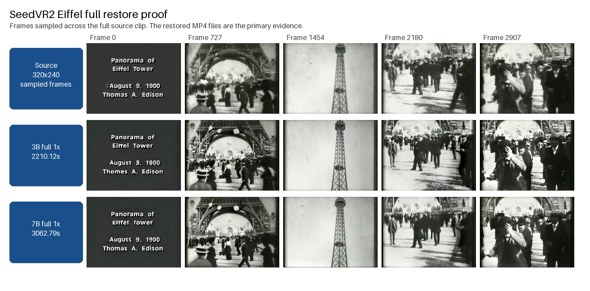
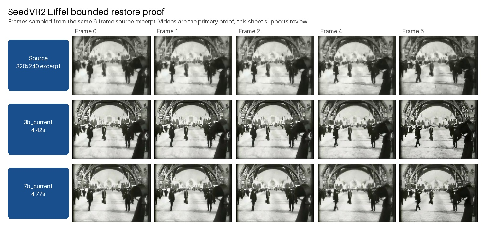
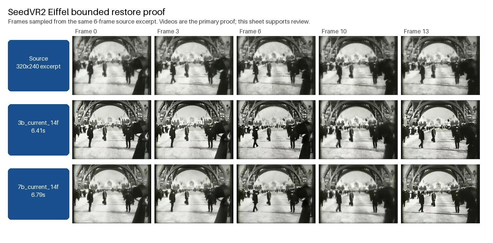
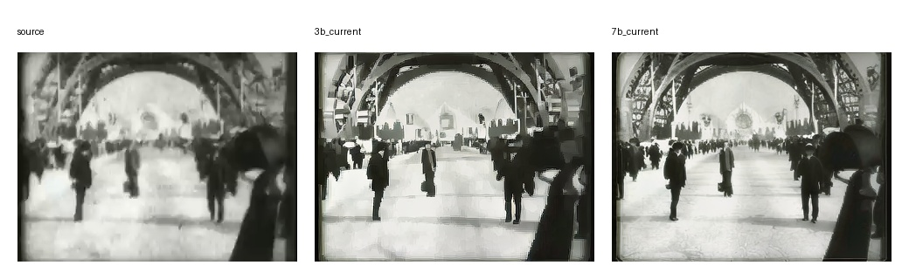
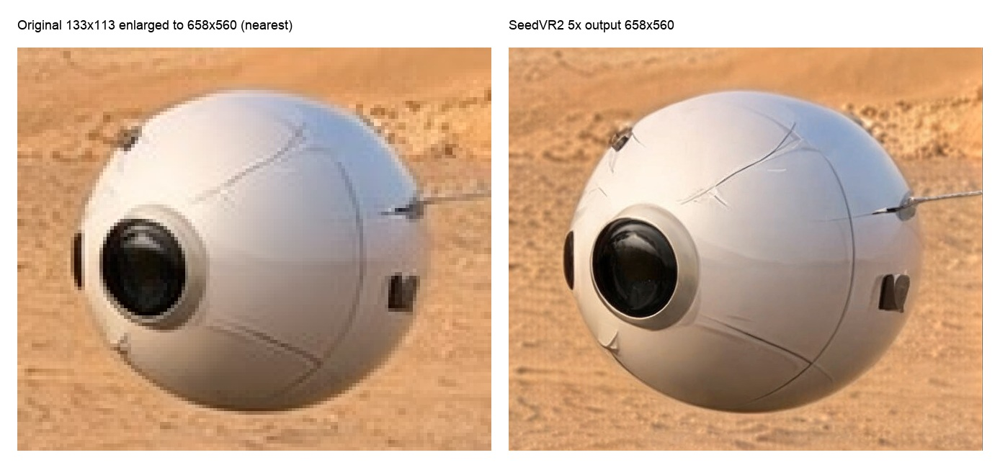

# Image And Video Upscaling

MLX-Gen routes SeedVR2 image and video restoration through `mlxgen upscale`. SeedVR2 is a diffusion
restoration/upscaling model: it can increase pixel dimensions while reconstructing detail and
smoothing low-resolution or compressed artifacts. It does not require a text prompt.

The older `mflux-upscale-seedvr2` entry point remains available for compatibility. New examples use
`mlxgen upscale`.

## Video Restoration

Video restoration uses the same command with `--video-path` instead of `--image-path`. MLX-Gen
preserves the source clip FPS by default, trims temporary SeedVR2 padding back to the requested
clip length, and currently writes a silent MP4 even when the source video contains audio.

The public safe video profile is conservative by design:

- if you omit `--resolution`, video restore defaults to `1x`;
- MLX-Gen enables `--low-ram` automatically for video inputs;
- the safe profile uses `--mlx-cache-limit-gb 8` as an MLX cache setting, not as a total process or
  machine-memory cap;
- the CLI uses sequential temporal chunking for video instead of the bounded in-memory direct path;
- enlarged video output profiles are rejected in safe mode unless you pass
  `--force-unsafe-video-memory`.

`--vae-tiling` is for image runs only and is rejected on video input.

Validated public example downloads:

```sh
mlxgen download --model ByteDance-Seed/SeedVR2-3B
mlxgen download --model ByteDance-Seed/SeedVR2-7B
```

Use short clips first when you want a quick parameter check:

```sh
mlxgen upscale \
  --model ByteDance-Seed/SeedVR2-3B \
  --video-path '/Users/albou/Downloads/Panorama of the Eiffel Tower in 1900 Thomas Edison Vintage Video.mp4' \
  --start-seconds 16 \
  --max-frames 6 \
  --resolution 1x \
  --softness 0.0 \
  --metadata \
  --output eiffel_16s_6f_restore_3b.mp4
```

The checked proof surface for this route now has two layers on the exact current tree:

- bounded `1x` source-size quick checks:
  - 6-frame official `3B` / `7B` video restore at `320x240`
  - 14-frame official `3B` / `7B` video restore at `320x240`
  - matching single-frame `1x` image restore from the same source frame
- full `97s` `1x` source-size long-run checks:
  - official `3B` full clip restore at `320x240`
  - official `7B` full clip restore at `320x240`

Use this exact bounded command for the primary route check:

```sh
mlxgen upscale \
  --model ByteDance-Seed/SeedVR2-3B \
  --video-path '/Users/albou/Downloads/Panorama of the Eiffel Tower in 1900 Thomas Edison Vintage Video.mp4' \
  --start-seconds 16 \
  --max-frames 6 \
  --resolution 1x \
  --softness 0.0 \
  --color-correction wavelet \
  --metadata \
  --output eiffel_16s_6f_restore_3b.mp4
```

Use this exact full-clip command for the current `3B` long-run proof:

```sh
mlxgen upscale \
  --model ByteDance-Seed/SeedVR2-3B \
  --video-path '/Users/albou/Downloads/Panorama of the Eiffel Tower in 1900 Thomas Edison Vintage Video.mp4' \
  --resolution 1x \
  --softness 0.0 \
  --color-correction wavelet \
  --metadata \
  --output eiffel_full_source3b_restore1x_current.mp4
```

Use this exact full-clip command for the current `7B` long-run proof on the same machine:

```sh
mlxgen upscale \
  --model ByteDance-Seed/SeedVR2-7B \
  --video-path '/Users/albou/Downloads/Panorama of the Eiffel Tower in 1900 Thomas Edison Vintage Video.mp4' \
  --resolution 1x \
  --softness 0.0 \
  --color-correction wavelet \
  --temporal-chunk-size 5 \
  --temporal-chunk-overlap 1 \
  --force-unsafe-video-memory \
  --metadata \
  --output eiffel_full_source7b_restore1x_current.mp4
```

Current full proof assets:

- [Restored 3B full video](assets/validation/seedvr2-video-2026-06-20/eiffel_full_source3b_restore1x_current.mp4)
- [Restored 7B full video](assets/validation/seedvr2-video-2026-06-20/eiffel_full_source7b_restore1x_current.mp4)
- [Full sampled contact sheet](assets/validation/seedvr2-video-2026-06-20/eiffel_full_3b_7b_current_contact_sheet.jpg)
- [Full sampled metrics](assets/validation/seedvr2-video-2026-06-20/eiffel_full_3b_7b_current_metrics.json)
- [Full command log](assets/validation/seedvr2-video-2026-06-20/seedvr2_video_restore_full_command_log.md)
- [Full timing and memory stats](assets/validation/seedvr2-video-2026-06-20/seedvr2_video_restore_full_stats_m5max.json)

The full sampled sheet below is the current long-run review aid:



Current bounded proof assets:

- [Restored 3B bounded video](assets/validation/seedvr2-video-2026-06-20/eiffel_16s_6f_3b_1x_current.mp4)
- [Restored 7B bounded video](assets/validation/seedvr2-video-2026-06-20/eiffel_16s_6f_7b_1x_current.mp4)

The 6-frame sheet below is the direct current-code review aid:



The 14-frame sheet below is the current stability check:



The matching single-frame image check from the same source frame is:



Supporting bounded metrics:

- [6-frame sampled metrics](assets/validation/seedvr2-video-2026-06-20/eiffel_16s_6f_3b_vs_7b_current_metrics.json)
- [14-frame sampled metrics](assets/validation/seedvr2-video-2026-06-20/eiffel_16s_14f_3b_vs_7b_current_metrics.json)

Measured on an Apple M5 Max with 128 GB unified memory:

- `3B full 1x` safe streaming profile: `generation_time 2210.12s`, `wall_time 2215.64s`,
  `peak_mlx 31.36 GB`, `max_rss 27.40 GB`
- `7B full 1x` explicit chunk-5 profile: `generation_time 3062.79s`, `wall_time 3070.42s`,
  `peak_mlx 22.93 GB`, `max_rss 66.18 GB`

Peak MLX memory and max RSS are different measurements. Peak MLX tracks allocator activity inside
MLX. Max RSS tracks the full process footprint seen by the OS.

On the exact current proofs:

- `3B 6f 1x`: `sharpness_gain 1.6969`, `contrast_gain 1.0822`, `drift_mae 0.065269`,
  `temporal_ratio 1.0075`
- `7B 6f 1x`: `sharpness_gain 1.5177`, `contrast_gain 1.0602`, `drift_mae 0.058795`,
  `temporal_ratio 0.8866`
- `3B 14f 1x`: visually sharper, but `temporal_ratio 1.7773` and `drift_mae 0.078679`
- `7B 14f 1x`: visually cleaner and more stable, with `temporal_ratio 1.2141` and
  `drift_mae 0.065077`
- `3B full 1x`: `sharpness_gain 1.7187`, `contrast_gain 1.0942`, `temporal_ratio 1.7634`,
  `drift_mae 0.069546`
- `7B full 1x`: `sharpness_gain 1.8153`, `contrast_gain 1.0720`, `temporal_ratio 1.1041`,
  `drift_mae 0.060194`

That is the current public conclusion:

- `3B` is a strong bounded restore route and the fresh `6f` current-code MP4 is byte-identical to
  the known-good June 20 `after_mmrope_fix` artifact.
- `7B` is the better balanced result on the current `14f`, single-frame, and full-source checks.
- `3B` remains the faster and lower-RSS full-route proof on this machine.

Metric interpretation:

- the metrics sample 48 frames across the full restored clip and downscale each sampled frame back
  to the original `320x240` source resolution before scoring;
- higher `sharpness_gain` and `contrast_gain` are good;
- lower `drift_mae` is better;
- `temporal_ratio` close to `1.0` is preferred because it means the restored clip changes over
  time at roughly the same rate as the source instead of becoming muddy or flickery.

These metrics are route-health aids, not a public family leaderboard.

One important scope note: MLX-Gen now exposes both official `ByteDance-Seed/SeedVR2-7B`
checkpoints:

- `seedvr2-7b` for the regular 7B checkpoint
- `seedvr2-7b-sharp` for the `seedvr2_ema_7b_sharp.pth` checkpoint

The sharp route is source-only today; there are no published `q8` or `q4` sharp packages yet.

Practical guidance:

- use `--start-seconds` and `--max-frames` for short, reproducible checks before running a longer
  clip;
- start with `--resolution 1x` and `--softness 0.0` when the goal is archival restoration rather
  than enlargement;
- when comparing `seedvr2-7b` on small or native-resolution archival clips, judge the actual
  frames and MP4 output directly instead of trusting one heuristic score;
- when the default safe planner refuses a longer `7B` full-clip run on a busy machine, reduce
  `--temporal-chunk-size` and `--temporal-chunk-overlap` first; the current full proof used
  `5` and `1`;
- increase `--resolution` to `2x` only after a short clip check proves the larger profile is still
  preserving detail instead of drifting muddy;
- use `--low-ram --mlx-cache-limit-gb 8` for longer clips and keep the default chunk profile
  unless you are deliberately retuning memory versus temporal overlap;
- prefer visibly degraded, noisy, low-resolution, or compressed footage for restoration/upscale
  proofs;
- treat already-clean high-resolution footage as a harder fit. In local testing, SeedVR2 could
  over-smooth modern native-resolution clips instead of improving them.

## 5x Example

The included example starts from a `133x113` JPEG and generates a `658x560` PNG with the
published `AbstractFramework/seedvr2-3b-8bit` package:

```sh
mlxgen download --model AbstractFramework/seedvr2-3b-8bit

mlxgen upscale \
  --model AbstractFramework/seedvr2-3b-8bit \
  --image-path docs/assets/upscaling/seedvr2-5x-source.jpg \
  --resolution 5x \
  --seed 42 \
  --metadata \
  --output seedvr2-5x-output.png
```

The left panel below shows the original source enlarged to the same `658x560` resolution with
nearest-neighbor resizing. The right panel is the SeedVR2 output generated by the command above.



The source and generated output are also included separately:

- [seedvr2-5x-source.jpg](assets/upscaling/seedvr2-5x-source.jpg)
- [seedvr2-5x-output.png](assets/upscaling/seedvr2-5x-output.png)

## Published Packages

For regular 3B use, prefer the reusable AbstractFramework packages:

```sh
mlxgen download --model AbstractFramework/seedvr2-3b-8bit
mlxgen download --model AbstractFramework/seedvr2-3b-4bit
```

Then pass the selected package to `mlxgen upscale`:

```sh
mlxgen upscale \
  --model AbstractFramework/seedvr2-3b-8bit \
  --image-path input.png \
  --resolution 2x \
  --seed 42 \
  --metadata \
  --output input_seedvr2_3b_q8_2x.png
```

The 3B packages are generated from the official `ByteDance-Seed/SeedVR2-3B` source model. They use
MLX-Gen's saved-weight layout and are intended for MLX-Gen, not Diffusers or Transformers
`from_pretrained()` loading. The q8 package is the closest low-memory option to the source path;
the q4 package is smaller and passed the included 5x validation profile.

The 7B section below includes a combined 3B/7B contact sheet using the same source image and `5x`
profile for direct comparison across source, q8, and q4 outputs.

## SeedVR2 7B

The `seedvr2-7b` and `seedvr2-7b-sharp` aliases both resolve to the official
`ByteDance-Seed/SeedVR2-7B` source repository:

```sh
mlxgen download --model ByteDance-Seed/SeedVR2-7B

mlxgen upscale \
  --model seedvr2-7b \
  --image-path input.png \
  --resolution 2x \
  --seed 42 \
  --metadata \
  --output input_seedvr2_7b_2x.png
```

To use the sharper official checkpoint directly:

```sh
mlxgen upscale \
  --model seedvr2-7b-sharp \
  --image-path input.png \
  --resolution 2x \
  --seed 42 \
  --metadata \
  --output input_seedvr2_7b_sharp_2x.png
```

You can prepare reusable local q8/q4 packages from the official 7B source:

```sh
mlxgen prepare \
  --model ByteDance-Seed/SeedVR2-7B \
  --path ./models/seedvr2-7b-8bit \
  --quantize 8

mlxgen prepare \
  --model ByteDance-Seed/SeedVR2-7B \
  --path ./models/seedvr2-7b-4bit \
  --quantize 4
```

The same package layout is used for the `AbstractFramework` 7B q8/q4 packages:

```sh
mlxgen download --model AbstractFramework/seedvr2-7b-8bit
mlxgen download --model AbstractFramework/seedvr2-7b-4bit
```

Run from a local or downloaded 7B package with the same command:

```sh
mlxgen upscale \
  --model ./models/seedvr2-7b-8bit \
  --image-path input.png \
  --resolution 2x \
  --seed 42 \
  --metadata \
  --output input_seedvr2_7b_q8_2x.png
```

The 7B source, q8 package, and q4 package passed the same checked-in `5x` profile used for 3B.
The sheet below stacks the 3B and 7B results so you can compare detail reconstruction directly:


## Model Sources

The short aliases `seedvr2` and `seedvr2-3b` resolve to the official upstream 3B checkpoint:

```sh
mlxgen download --model ByteDance-Seed/SeedVR2-3B

mlxgen upscale \
  --model ByteDance-Seed/SeedVR2-3B \
  --image-path input.png \
  --resolution 2x \
  --seed 42 \
  --metadata \
  --output input_seedvr2_official_3b_2x.png
```

Runtime quantization also works on the official source path:

```sh
mlxgen upscale \
  --model ByteDance-Seed/SeedVR2-3B \
  --image-path input.png \
  --resolution 2x \
  --seed 42 \
  --quantize 8 \
  --metadata \
  --output input_seedvr2_official_3b_q8_2x.png
```

Use `--quantize 4` the same way for a q4 runtime check. Runtime quantization loads the official
checkpoint first, then quantizes applicable MLX modules in memory. Published q8/q4 packages skip
that source-load step and are smaller on disk.

To create your own local package from the official source:

```sh
mlxgen prepare \
  --model ByteDance-Seed/SeedVR2-3B \
  --path ./models/seedvr2-3b-8bit \
  --quantize 8
```

Use `ByteDance-Seed/SeedVR2-7B` and a `seedvr2-7b-*` path for 7B packages.

## Sizing

`--resolution` accepts either an integer shorter-edge target or a scale factor:

| Form | Meaning | Example |
| --- | --- | --- |
| `--resolution 1024` | Preserve aspect ratio and set the shorter output edge near 1024px. | A `640x384` image becomes about `1706x1024` after normalization. |
| `--resolution 2x` | Preserve aspect ratio and scale the source by about 2x. | A `320x192` image becomes `640x384`. |
| `--resolution 5x` | Preserve aspect ratio and scale the source by about 5x. | The included `133x113` source becomes `658x560`. |

Final dimensions may be normalized to dimensions supported by the model/runtime. Metadata sidecars
record the source size, requested resolution, and final output size.

## Quality Controls

For visual upscaling checks, choose a target that materially increases pixel dimensions. A target
close to the source size can be useful for restoration or denoising checks, but it is not a strong
proof of super-resolution.

Useful options:

| Option | Use |
| --- | --- |
| `--quantize 8` | Runtime q8 quantization for the SeedVR2 model. |
| `--softness 0.25` to `0.5` | Smooth noisy low-resolution conditioning before reconstruction. |
| `--vae-tiling` | Force tiled VAE encode/decode for image runs. Video restore rejects it. |
| `--color-correction wavelet` | Preferred long-video restore color mode on the checked-in Eiffel archival proof. |
| `--temporal-chunk-size` / `--temporal-chunk-overlap` | Tune long-video memory use and overlap blending. The checked-in Eiffel proof used `49` and `16`. |
| `--low-ram --mlx-cache-limit-gb 8` | Recommended long-video restore profile when memory pressure matters. |
| `--metadata` | Save a `.metadata.json` sidecar with source/output dimensions and generation settings. |
| `--start-seconds` / `--max-frames` | For video inputs, bound the decoded source clip before restoration. |

`--softness` controls how strongly MLX-Gen smooths the source image before SeedVR2 conditions on
it. At `0.0`, the model receives the source at full preprocessed detail. At higher values, MLX-Gen
temporarily downsamples the conditioning image and scales it back to the target size before
generation; this suppresses source grain, JPEG texture, and small sensor noise that SeedVR2 might
otherwise reconstruct as detail. Use `0.0` for clean sources and fine detail preservation, try
`0.25` to `0.5` for noisy or compressed sources, and reserve higher values for sources where a
smoother, less faithful reconstruction is acceptable.

Use `--vae-tiling` only for image runs when you also want tiled VAE encoding, or when you want the
same tiled path even for smaller outputs. Large image outputs automatically use tiled VAE decode
even without this flag. Video restore rejects `--vae-tiling`; use `--low-ram` and chunking there.
