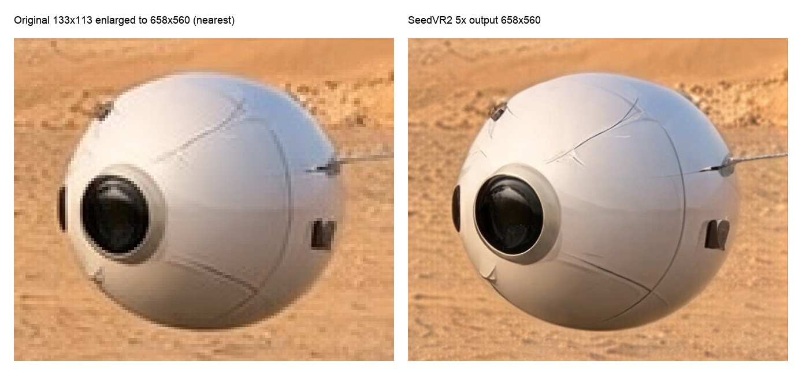

# Image And Video Upscaling

MLX-Gen routes image and video restoration through `mlxgen upscale`, which hosts two model
families. Select one with `--model`.

- **SeedVR2** is a diffusion restoration/upscaling model: it can increase pixel dimensions while
  reconstructing detail and smoothing low-resolution or compressed artifacts. Handles
  `seedvr2-3b`, `seedvr2-7b`, `seedvr2-7b-sharp`, official ByteDance repos, and AbstractFramework
  packages.
- **SwiftVR** is a one-step restorer built on Wan2.2-TI2V-5B. It restores at the source resolution
  only - it does not scale - and is roughly 40x faster than SeedVR2 on the same clip. Handles
  `swiftvr` and `swiftvr-5b`. See [SwiftVR One-Step Restoration](#swiftvr-one-step-restoration).

Neither family requires a text prompt.

| | SeedVR2 | SwiftVR |
| --- | --- | --- |
| Images | yes | no |
| Video | yes | yes |
| Scaling | yes | source resolution only (`1x`) |
| Quantization | q8 / q4 packages | none (bf16) |

Both families declare what they accept, so you can check a route before starting a run:

```sh
mlxgen capabilities --model swiftvr
mlxgen capabilities --model seedvr2-3b
```

The `restoration` array reports accepted media, input counts, scale factors, the clip-length
contract, and quantization support for every route. See
[Restoration Commands](api.md#restoration-commands) for the field reference and the Python route
names.

The older `mflux-upscale-seedvr2` entry point remains available for compatibility. New examples use
`mlxgen upscale`.

## Video Restoration

Video restoration uses the same command with `--video-path` instead of `--image-path`. MLX-Gen
preserves the source clip FPS by default, trims temporary SeedVR2 padding back to the requested
clip length, and preserves the matching source audio segment by default when the source clip has
audio. If MLX-Gen cannot prove that copied audio is still aligned safely, the run fails instead of
publishing a silent output unexpectedly. Use `--drop-audio` only when you intentionally want a
silent restored MP4.

The public safe video profile is conservative by design:

- if you omit `--resolution`, video restore defaults to `1x`;
- MLX-Gen enables `--low-ram` automatically for video inputs;
- `--mlx-cache-limit-gb 8` is an MLX cache setting, not a total process-memory cap;
- the CLI uses sequential temporal chunking for video instead of the bounded in-memory direct path;
- enlarged video output profiles are rejected in safe mode unless you pass
  `--force-unsafe-video-memory`.

`--vae-tiling` is for image runs only and is rejected on video input.

### Audio Copy-Through

SeedVR2 video restore uses one shared post-write audio path for bounded and streamed outputs.

- `audio_present` records whether the source clip had audio.
- `audio_copied` records whether MLX-Gen kept the matching source segment.
- `audio_copy_mode` records the successful mux path.
- `audio_copy_reason` records why a saved output has no copied audio, for example
  `drop_audio_requested`, `no_source_audio`, or `in_memory_output`.

The shipped route uses `ffmpeg` for sync-safe muxing. If `ffmpeg` is not available on `PATH`, or if
the written MP4 duration no longer matches the bounded source window closely enough, MLX-Gen fails
the run instead of silently dropping audio. Pass `--drop-audio` when a silent MP4 is the intended
output.

Accepted published proof bundle:

- [Air France source excerpt](assets/validation/seedvr2-video-audio-2026-06-21/air_france_25s_10s_source_excerpt.mp4)
- [Air France copied-audio output](assets/validation/seedvr2-video-audio-2026-06-21/air_france_25s_10s_audio_copied.mp4)
- [Air France stream report](assets/validation/seedvr2-video-audio-2026-06-21/air_france_25s_10s_stream_report.json)
- [Air France audio-copy report](assets/validation/seedvr2-video-audio-2026-06-21/air_france_25s_10s_audio_copythrough_report.md)
- [Air France command log](assets/validation/seedvr2-video-audio-2026-06-21/seedvr2_audio_copythrough_command_log.md)

Useful option:

- `--drop-audio`: opt out of the default audio-preservation contract and publish a silent restored
  MP4 intentionally.

### Reader-First Validation Rule

MLX-Gen now treats five contiguous seconds as the minimum public-quality proof for SeedVR2 video.
Sub-second clips are still useful for local diagnostics, but they are not enough to judge cadence,
time dilation, or motion distortion. See
[ADR 0005](adr/0005_seedvr2_video_quality_proof_requires_five_second_reader_first_clips.md).

For the checked-in Eiffel archival proof, the accepted reader-first slice is:

- source video: `Panorama of the Eiffel Tower in 1900 Thomas Edison Vintage Video.mp4`
- clip window: `70.0s` to `75.0s`
- source geometry: `320x240`
- source duration under test: `149` frames at `29.97 fps` (`4.972s`)

Set the source file path once:

```sh
SOURCE_VIDEO="Panorama of the Eiffel Tower in 1900 Thomas Edison Vintage Video.mp4"
```

Run the accepted safe bounded `1x` proof with the official source checkpoints:

```sh
mlxgen upscale \
  --model ByteDance-Seed/SeedVR2-3B \
  --video-path "$SOURCE_VIDEO" \
  --start-seconds 70 \
  --max-frames 149 \
  --resolution 1x \
  --softness 0.0 \
  --color-correction wavelet \
  --temporal-chunk-size 29 \
  --temporal-chunk-overlap 8 \
  --low-ram \
  --mlx-cache-limit-gb 8 \
  --metadata \
  --output eiffel_70s_149f_3b_chunk29_overlap8_wavelet_1x_after_causal_slicing.mp4
```

```sh
mlxgen upscale \
  --model ByteDance-Seed/SeedVR2-7B \
  --video-path "$SOURCE_VIDEO" \
  --start-seconds 70 \
  --max-frames 149 \
  --resolution 1x \
  --softness 0.0 \
  --color-correction wavelet \
  --temporal-chunk-size 29 \
  --temporal-chunk-overlap 8 \
  --low-ram \
  --mlx-cache-limit-gb 8 \
  --metadata \
  --output eiffel_70s_149f_7b_chunk29_overlap8_wavelet_1x_after_causal_slicing.mp4
```

Run the accepted enlarged `2x` comparison only after the `1x` slice looks right on the same clip:

```sh
mlxgen upscale \
  --model ByteDance-Seed/SeedVR2-3B \
  --video-path "$SOURCE_VIDEO" \
  --start-seconds 70 \
  --max-frames 149 \
  --resolution 2x \
  --softness 0.0 \
  --color-correction wavelet \
  --temporal-chunk-size 29 \
  --temporal-chunk-overlap 8 \
  --low-ram \
  --mlx-cache-limit-gb 8 \
  --force-unsafe-video-memory \
  --metadata \
  --output eiffel_70s_149f_3b_chunk29_overlap8_wavelet_2x_after_causal_slicing.mp4
```

```sh
mlxgen upscale \
  --model ByteDance-Seed/SeedVR2-7B \
  --video-path "$SOURCE_VIDEO" \
  --start-seconds 70 \
  --max-frames 149 \
  --resolution 2x \
  --softness 0.0 \
  --color-correction wavelet \
  --temporal-chunk-size 29 \
  --temporal-chunk-overlap 8 \
  --low-ram \
  --mlx-cache-limit-gb 8 \
  --force-unsafe-video-memory \
  --metadata \
  --output eiffel_70s_149f_7b_chunk29_overlap8_wavelet_2x_after_causal_slicing.mp4
```

`29/8` means:

- restore `29` source frames per chunk;
- reuse `8` source frames as context between adjacent chunks;
- do not crossfade output frames together.

This matters because the overlap is there to keep the model temporally grounded, not to blend two
different restored outputs into one display frame.

### Color-Correction Labels

The CLI values stay short, but the meanings are:

| CLI value | Reader-first label | What it does |
| --- | --- | --- |
| `wavelet` | Wavelet tone reconstruction | Restores detail, then reuses the source clip's broad low-frequency tone structure. This is the current default and the accepted Eiffel proof mode. |
| `lab` | LAB tone matching | Matches the restored output back toward the source in perceptual LAB space. Usually a bit more conservative than `wavelet`. |
| `off` | Raw model output | Leaves the restored output untouched by tone/color post-processing. |

On monochrome archival footage, these are really tone-matching choices more than ordinary color
choices.

### Accepted Proof Bundle

Reader-first report and reproduction files:

- [Validation report](assets/validation/seedvr2-video-2026-06-21/eiffel_70s_149f_validation_report.md)
- [Command log](assets/validation/seedvr2-video-2026-06-21/seedvr2_video_restore_command_log.md)
- [Timing and memory stats](assets/validation/seedvr2-video-2026-06-21/seedvr2_video_restore_stats_m5max.json)

Safe `1x` bounded proof:

- [3B 1x restored video](assets/validation/seedvr2-video-2026-06-21/eiffel_70s_149f_3b_chunk29_overlap8_wavelet_1x_after_causal_slicing.mp4)
- [7B 1x restored video](assets/validation/seedvr2-video-2026-06-21/eiffel_70s_149f_7b_chunk29_overlap8_wavelet_1x_after_causal_slicing.mp4)
- [1x comparison video](assets/validation/seedvr2-video-2026-06-21/eiffel_70s_149f_3b_vs_7b_wavelet_1x_after_causal_slicing_comparison.mp4)
- [1x contact sheet](assets/validation/seedvr2-video-2026-06-21/eiffel_70s_149f_3b_vs_7b_wavelet_1x_after_causal_slicing_contact_sheet.jpg)
- [1x mid-clip motion strip](assets/validation/seedvr2-video-2026-06-21/motion_strip_1x_after_causal_slicing_frames_64_72.jpg)
- [1x tail motion strip](assets/validation/seedvr2-video-2026-06-21/motion_strip_1x_after_causal_slicing_frames_141_148.jpg)
- [1x metrics JSON](assets/validation/seedvr2-video-2026-06-21/eiffel_70s_149f_3b_vs_7b_wavelet_1x_after_causal_slicing_metrics.json)

Enlarged `2x` bounded proof:

- [3B 2x restored video](assets/validation/seedvr2-video-2026-06-21/eiffel_70s_149f_3b_chunk29_overlap8_wavelet_2x_after_causal_slicing.mp4)
- [7B 2x restored video](assets/validation/seedvr2-video-2026-06-21/eiffel_70s_149f_7b_chunk29_overlap8_wavelet_2x_after_causal_slicing.mp4)
- [2x comparison video](assets/validation/seedvr2-video-2026-06-21/eiffel_70s_149f_3b_vs_7b_wavelet_2x_after_causal_slicing_comparison.mp4)
- [2x contact sheet](assets/validation/seedvr2-video-2026-06-21/eiffel_70s_149f_3b_vs_7b_wavelet_2x_after_causal_slicing_contact_sheet.jpg)
- [2x moving-crowd motion strip](assets/validation/seedvr2-video-2026-06-21/motion_strip_2x_after_causal_slicing_frames_64_72.jpg)
- [2x tail motion strip](assets/validation/seedvr2-video-2026-06-21/motion_strip_2x_after_causal_slicing_frames_141_149.jpg)
- [2x crowd detail crop](assets/validation/seedvr2-video-2026-06-21/detail_crop_crowd_2x_after_causal_slicing_64_72.jpg)
- [2x metrics JSON](assets/validation/seedvr2-video-2026-06-21/eiffel_70s_149f_3b_vs_7b_wavelet_2x_after_causal_slicing_metrics.json)

### Supported Public Proof Profiles

Accepted public profiles for this exact archival slice:

- safe bounded `1x 29/8 wavelet` for `3B` and `7B`
- explicit enlarged `2x 29/8 wavelet` for `3B` and `7B`

Current guidance:

- `1x 29/8` is the default public video proof surface for route correctness, frame integrity, and
  motion continuity;
- `3B 1x 29/8` is crisper on this native archival slice, while `7B 1x 29/8` is smoother and less
  drift-prone;
- `2x 29/8` is the stronger visual comparison regime on this clip, and `7B 2x 29/8`
  result is slightly cleaner and more stable than `3B 2x 29/8`.

Supporting metrics on the accepted proofs, after downscaling each candidate back to the
original `320x240` source resolution before scoring:

- `3B 1x 29/8`: `sharpness_gain 1.5240`, `contrast_gain 1.1046`, `temporal_ratio 1.5097`,
  `drift_mae 0.056926`, `heuristic_score 58.65`
- `7B 1x 29/8`: `sharpness_gain 1.2258`, `contrast_gain 1.0682`, `temporal_ratio 1.2874`,
  `drift_mae 0.041031`, `heuristic_score 60.72`
- `3B 2x 29/8`: `sharpness_gain 1.4096`, `contrast_gain 1.0504`, `temporal_ratio 1.3493`,
  `drift_mae 0.035856`, `heuristic_score 61.63`
- `7B 2x 29/8`: `sharpness_gain 1.4176`, `contrast_gain 1.0523`, `temporal_ratio 1.3563`,
  `drift_mae 0.033749`, `heuristic_score 62.57`

These metrics are supporting evidence only. The comparison MP4 and motion/crop sheets are the
primary quality proof.

Measured on an Apple M5 Max with 128 GB unified memory for the accepted `29/8` proofs:

- `3B 1x 29/8`: `generation_time 71.33s`, `wall_time 74.54s`, `peak_mlx 14.55 GB`,
  `max_rss 27.40 GB`
- `7B 1x 29/8`: `generation_time 107.44s`, `wall_time 112.93s`, `peak_mlx 24.54 GB`,
  `max_rss 66.18 GB`
- `3B 2x 29/8`: `generation_time 539.03s`, `wall_time 542.30s`, `peak_mlx 34.40 GB`,
  `max_rss 27.40 GB`
- `7B 2x 29/8`: `generation_time 454.46s`, `wall_time 460.61s`, `peak_mlx 44.27 GB`,
  `max_rss 66.18 GB`

Peak MLX memory and max RSS are different measurements. Peak MLX tracks allocator activity inside
MLX. Max RSS tracks the full process footprint seen by the OS.

Practical guidance:

- use `--start-seconds` and `--max-frames` to validate a real five-second slice before longer
  runs;
- start with the safe `1x 29/8` profile and `--softness 0.0` when the goal is archival
  restoration rather than enlargement;
- use `2x 29/8` only after the same slice looks correct at `1x`, because enlarged proof is an
  explicit unsafe-memory run;
- use `wavelet` first, then compare `lab` and `off` only if tone matching looks wrong on the
  actual clip;
- judge the MP4 and motion-strip output directly instead of trusting one heuristic score;
- prefer visibly degraded, noisy, low-resolution, or compressed footage for restoration proofs;
- treat already-clean high-resolution footage as a harder fit. In local testing, SeedVR2 could
  over-smooth modern native-resolution clips instead of improving them.

## 5x Example

The included example starts from a `133x113` JPEG and generates a `658x560` PNG with the
published `AbstractFramework/seedvr2-3b-8bit` package:

```sh
mlxgen download --model AbstractFramework/seedvr2-3b-8bit

mlxgen upscale \
  --model AbstractFramework/seedvr2-3b-8bit \
  --image-path docs/assets/upscaling/seedvr2-5x-source.jpg \
  --resolution 5x \
  --seed 42 \
  --metadata \
  --output seedvr2-5x-output.png
```

The left panel below shows the original source enlarged to the same `658x560` resolution with
nearest-neighbor resizing. The right panel is the SeedVR2 output generated by the command above.



The source and generated output are also included separately:

- [seedvr2-5x-source.jpg](assets/upscaling/seedvr2-5x-source.jpg)
- [seedvr2-5x-output.png](assets/upscaling/seedvr2-5x-output.png)

## Published Packages

For regular 3B use, prefer the reusable AbstractFramework packages:

```sh
mlxgen download --model AbstractFramework/seedvr2-3b-8bit
mlxgen download --model AbstractFramework/seedvr2-3b-4bit
```

Then pass the selected package to `mlxgen upscale`:

```sh
mlxgen upscale \
  --model AbstractFramework/seedvr2-3b-8bit \
  --image-path input.png \
  --resolution 2x \
  --seed 42 \
  --metadata \
  --output input_seedvr2_3b_q8_2x.png
```

The 3B packages are generated from the official `ByteDance-Seed/SeedVR2-3B` source model. They use
MLX-Gen's saved-weight layout and are intended for MLX-Gen, not Diffusers or Transformers
`from_pretrained()` loading. The q8 package is the closest low-memory option to the source path;
the q4 package is smaller and passed the included 5x validation profile.

The 7B section below includes a combined 3B/7B contact sheet using the same source image and `5x`
profile for direct comparison across source, q8, and q4 outputs.

## SeedVR2 7B

The `seedvr2-7b` and `seedvr2-7b-sharp` aliases both resolve to the official
`ByteDance-Seed/SeedVR2-7B` source repository:

```sh
mlxgen download --model ByteDance-Seed/SeedVR2-7B

mlxgen upscale \
  --model seedvr2-7b \
  --image-path input.png \
  --resolution 2x \
  --seed 42 \
  --metadata \
  --output input_seedvr2_7b_2x.png
```

To use the sharper official checkpoint directly:

```sh
mlxgen upscale \
  --model seedvr2-7b-sharp \
  --image-path input.png \
  --resolution 2x \
  --seed 42 \
  --metadata \
  --output input_seedvr2_7b_sharp_2x.png
```

You can prepare reusable local q8/q4 packages from the official 7B source:

```sh
mlxgen prepare \
  --model ByteDance-Seed/SeedVR2-7B \
  --path ./models/seedvr2-7b-8bit \
  --quantize 8

mlxgen prepare \
  --model ByteDance-Seed/SeedVR2-7B \
  --path ./models/seedvr2-7b-4bit \
  --quantize 4
```

The same package layout is used for the `AbstractFramework` 7B q8/q4 packages:

```sh
mlxgen download --model AbstractFramework/seedvr2-7b-8bit
mlxgen download --model AbstractFramework/seedvr2-7b-4bit
```

Run from a local or downloaded 7B package with the same command:

```sh
mlxgen upscale \
  --model ./models/seedvr2-7b-8bit \
  --image-path input.png \
  --resolution 2x \
  --seed 42 \
  --metadata \
  --output input_seedvr2_7b_q8_2x.png
```

The 7B source, q8 package, and q4 package passed the same checked-in `5x` profile used for 3B.
The sheet below stacks the 3B and 7B results so you can compare detail reconstruction directly:


## SwiftVR One-Step Restoration

`swiftvr` restores video in a single forward pass per chunk rather than a diffusion trajectory. It
is the fast route: on the comparison below it runs about 40x faster than SeedVR2 at roughly a fifth
of the peak memory.

```bash
mlxgen upscale --model swiftvr --video-path clip.mp4 --resolution 1x --output restored.mp4
```

Route constraints, all fail-closed rather than approximated:

- **Source resolution only.** SwiftVR reaches other sizes upstream by bilinear pre-upsampling of the
  degraded input, which MLX-Gen has not matched or measured. Any `--resolution` other than `1x` is
  refused with a message pointing at SeedVR2 rather than silently approximating it.
- **BF16 only.** There is no q8/q4 prepared package for this route yet.
- **Clip length is trimmed to `4a + 1`** frames by the chunk protocol; the CLI reports the trim.
- Audio is preserved on the same terms as the SeedVR2 route.

Do not read the upstream "real-time streaming" framing as an Apple Silicon claim. Measured here,
SwiftVR restores 1080p at about 1.1 FPS - useful for offline batch work, and roughly 20x short of
real time. It is fast relative to SeedVR2, not fast in absolute terms.

### Why SwiftVR restores video but not stills

SwiftVR's chunk protocol accepts a single frame: `t = 1` is a legal `4a + 1` clip, it plans as one
chunk, and the decoder's three-frame head trim leaves exactly one frame. A one-frame clip therefore
runs to completion through `--video-path`.

Output quality is what withholds the route. Restoring a single frame seeds the causal autoencoder
state from a replicated frame instead of real temporal context. At 1:1 the restored frame is
acceptable but soft; under magnification facial features lose structure, with eyes flattening into
smudges and fine texture smoothing over. SeedVR2's image route resolves the same detail cleanly on
identical input, so stills route there.

Measured across three subjects:
[contact sheet](assets/validation/swiftvr-vs-seedvr2-2026-08-17/swiftvr_single_frame_contact_sheet.png),
[face detail crop at 3.4x](assets/validation/swiftvr-vs-seedvr2-2026-08-17/swiftvr_single_frame_detail_crop_face.png),
[metrics](assets/validation/swiftvr-vs-seedvr2-2026-08-17/swiftvr_single_frame_metrics.json).
Read the sheets rather than the correlation column: SwiftVR scores higher than SeedVR2 on two of the
three samples while being visibly worse, so the number does not separate the two routes.

Restore stills with `--model seedvr2-3b`.

### Reaching other output sizes

SwiftVR has no learned upscaler. Upstream reaches larger outputs by resizing the degraded input with
bilinear interpolation and restoring at that size, so the model always restores at whatever
resolution it is handed. MLX-Gen has not matched or measured that pre-upsampling step, so
`--resolution` other than `1x` is refused rather than approximated.

If you want a larger SwiftVR output today, do the resize yourself and restore at `1x`:

```sh
ffmpeg -i clip.mp4 -vf scale=iw*2:ih*2 upscaled.mp4
mlxgen upscale --model swiftvr --video-path upscaled.mp4 --resolution 1x --output restored.mp4
```

That is the same order of operations upstream performs. For a learned upscale, use SeedVR2, which
reconstructs detail while increasing pixel dimensions.

### Choosing between SwiftVR and SeedVR2

Measured on an M4 Max over 121 contiguous frames (5.04 s at 24 fps) of grain-heavy archival footage
at 384x288, `1x`:

| Candidate | Wall | FPS | Fidelity to source | Frames below 0.90 | Peak MLX |
| --- | ---: | ---: | ---: | ---: | ---: |
| SwiftVR | 11.5 s | 10.52 | 0.9588 | 0 / 121 | 11.1 GB |
| SeedVR2-3B | 471.0 s | 0.257 | 0.9647 | 0 / 121 | 57.9 GB |
| SeedVR2-7B | 458.8 s | 0.264 | 0.9809 | 0 / 121 | 67.8 GB |

All three are temporally stable at this geometry. The quality difference is a trade-off rather than
a ranking: **SwiftVR reinterprets texture where SeedVR2 recovers it.** On the archival source
SwiftVR erases film grain and posterises fine ornament into smooth forms, producing a clean but
visibly synthetic image, while SeedVR2-7B keeps the most natural texture and scores the highest
fidelity. Judge this from the detail crops, not from a sharpness number - a plain gradient metric
ranks SwiftVR highest precisely because posterised edges are steep.

Full artifacts, including the contiguous motion strip and two magnified detail crops:
[swiftvr-vs-seedvr2-2026-08-17](assets/validation/swiftvr-vs-seedvr2-2026-08-17/paris_121f_validation_report.md).

Rules of thumb:

- long material, previews, or throughput-bound batch work: **SwiftVR**;
- archival or grain-sensitive material where fidelity matters most: **SeedVR2-7B**;
- SeedVR2-3B sits between them and, on this clip, offered no speed advantage over 7B.

### Known limitation on SeedVR2 at larger geometries

SeedVR2 currently cannot restore sources at 480x360 correctly. The minimum permitted 29-frame chunk
exceeds the host-safe memory budget at that geometry, and forcing it through with
`--force-unsafe-video-memory` produces intermittent corrupted frames - one pixel frame in every
latent group of four. 320x240 and 384x288 are clean. This is tracked in backlog item
[0115](backlog/proposed/0115_seedvr2_video_decode_artifact_at_larger_geometries.md). SwiftVR is
unaffected and restores the same source at native 480x360.

## Model Sources

The short aliases `seedvr2` and `seedvr2-3b` resolve to the official upstream 3B checkpoint:

```sh
mlxgen download --model ByteDance-Seed/SeedVR2-3B

mlxgen upscale \
  --model ByteDance-Seed/SeedVR2-3B \
  --image-path input.png \
  --resolution 2x \
  --seed 42 \
  --metadata \
  --output input_seedvr2_official_3b_2x.png
```

Runtime quantization also works on the official source path:

```sh
mlxgen upscale \
  --model ByteDance-Seed/SeedVR2-3B \
  --image-path input.png \
  --resolution 2x \
  --seed 42 \
  --quantize 8 \
  --metadata \
  --output input_seedvr2_official_3b_q8_2x.png
```

Use `--quantize 4` the same way for a q4 runtime check. Runtime quantization loads the official
checkpoint first, then quantizes applicable MLX modules in memory. Published q8/q4 packages skip
that source-load step and are smaller on disk.

To create your own local package from the official source:

```sh
mlxgen prepare \
  --model ByteDance-Seed/SeedVR2-3B \
  --path ./models/seedvr2-3b-8bit \
  --quantize 8
```

Use `ByteDance-Seed/SeedVR2-7B` and a `seedvr2-7b-*` path for 7B packages.

## Sizing

`--resolution` accepts either an integer shorter-edge target or a scale factor:

| Form | Meaning | Example |
| --- | --- | --- |
| `--resolution 1024` | Preserve aspect ratio and set the shorter output edge near 1024px. | A `640x384` image becomes about `1706x1024` after normalization. |
| `--resolution 2x` | Preserve aspect ratio and scale the source by about 2x. | A `320x192` image becomes `640x384`. |
| `--resolution 5x` | Preserve aspect ratio and scale the source by about 5x. | The included `133x113` source becomes `658x560`. |

Image restoration preserves the requested geometry exactly: `--resolution 1x` returns the input
dimensions pixel-for-pixel with no resampling, and integer shorter-edge targets keep the exact
source aspect ratio. Network divisibility is satisfied internally with reflective edge padding
that is cropped away after decoding, never by snapping or resizing the output. Video restoration
center-crops each frame to the nearest multiple of 16, matching the official SeedVR2 pipeline.
Metadata sidecars record the source size, requested resolution, and final output size.

## Quality Controls

For visual upscaling checks, choose a target that materially increases pixel dimensions. A target
close to the source size can be useful for restoration or denoising checks, but it is not a strong
proof of super-resolution.

Useful options:

| Option | Use |
| --- | --- |
| `--quantize 8` | Runtime q8 quantization for the SeedVR2 model. |
| `--steps 1` to `4` | Force a fixed step count for image restoration. Default is automatic: single step, plus a measured 4-step refinement only when the one-step noise texture is detected. |
| `--softness 0.25` to `0.5` | Smooth noisy low-resolution conditioning before reconstruction. |
| `--vae-tiling` | Force tiled VAE encode/decode for image runs. Video restore rejects it. |
| `--color-correction wavelet` | Preferred long-video restore color mode on the checked-in Eiffel archival proof. |
| `--temporal-chunk-size` / `--temporal-chunk-overlap` | Tune long-video memory use and overlap context. The checked-in Eiffel production proof used `29` and `8`; smaller multi-chunk profiles are rejected to protect temporal continuity. |
| `--low-ram --mlx-cache-limit-gb 8` | Recommended long-video restore profile when memory pressure matters. |
| `--metadata` | Save a `.metadata.json` sidecar with source/output dimensions and generation settings. |
| `--start-seconds` / `--max-frames` | For video inputs, bound the decoded source clip before restoration. |

`--softness` controls how strongly MLX-Gen smooths the source image before SeedVR2 conditions on
it. At `0.0`, the model receives the source at full preprocessed detail. At higher values, MLX-Gen
temporarily downsamples the conditioning image and scales it back to the target size before
generation; this suppresses source grain, JPEG texture, and small sensor noise that SeedVR2 might
otherwise reconstruct as detail. Use `0.0` for clean sources and fine detail preservation, try
`0.25` to `0.5` for noisy or compressed sources, and reserve higher values for sources where a
smoother, less faithful reconstruction is acceptable.

Use `--vae-tiling` only for image runs when you also want tiled VAE encoding, or when you want the
same tiled path even for smaller outputs. Large image outputs automatically use tiled VAE decode
even without this flag. Video restore rejects `--vae-tiling`; use `--low-ram` and chunking there.

### Steps for Flat or Dark Content

SeedVR2 is a one-step restoration model. On content dominated by smooth gradients or darkness —
night scenes, astrophotography, fog, studio backdrops — the single-step estimate retains a small
amount of the sampling noise, which decodes as a faint, regular mesh-like texture aligned to an
8-pixel grid, together with a loss of the faintest real detail. On detail-rich content the same
residue is fully masked, and extra steps instead begin to synthesize texture that is not in the
source (measured on portrait, super-resolution, and landscape content), so no fixed step count is
right for every image.

By default `--steps` is therefore automatic: MLX-Gen runs the official single step, measures the
8-pixel lattice signature of the decoded output against the source, and only when the artifact
is actually present re-runs the restoration at 4 steps (a few extra seconds on a ~1500px image).
The metadata sidecar records the decision (`steps_mode`: `auto` or `auto-refined`, with the
measured `one_step_residue_pct`). Passing an explicit `--steps 1`-`4` forces a fixed count and
skips the measurement.

The 4-step refinement removes the regular mesh below the model's own reconstruction floor and
retains faint real structure (dim stars, nebular wisps) noticeably better, replacing the pattern
with irregular film-like grain. Content that far outside SeedVR2's training distribution keeps
some synthesized micro-texture at any step count — for archival astrophotography a dedicated
astronomical denoiser remains the better tool, while SeedVR2 is at its best restoring
compressed, blurred, or low-resolution photographic and video content. `--steps` applies to
image inputs only; video restoration always uses the official one-step path.
